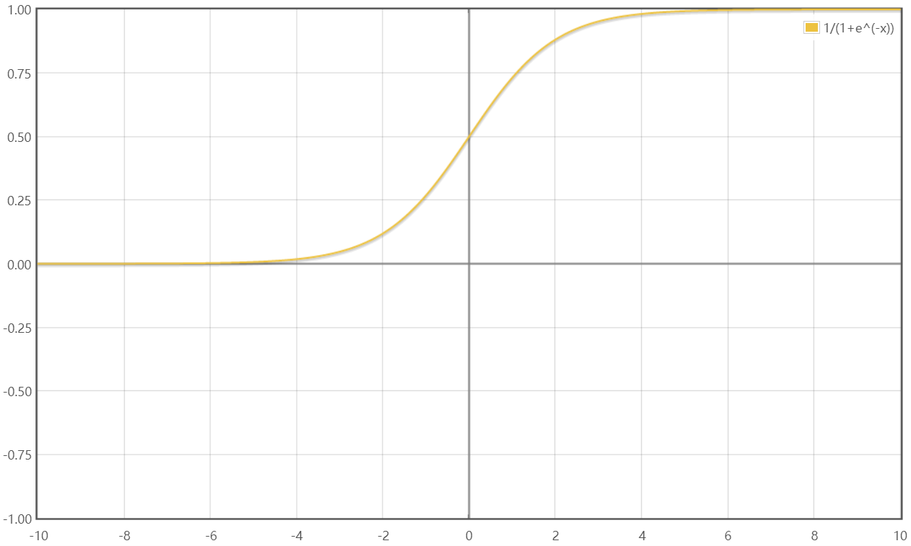
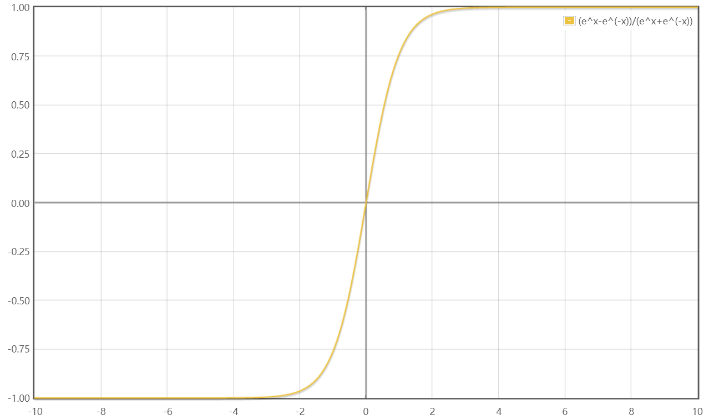
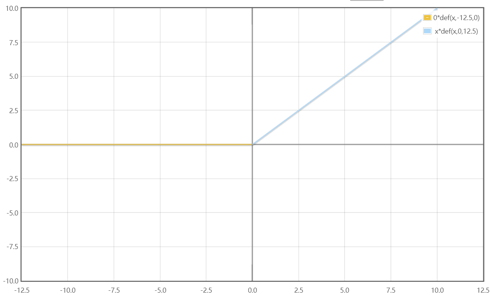
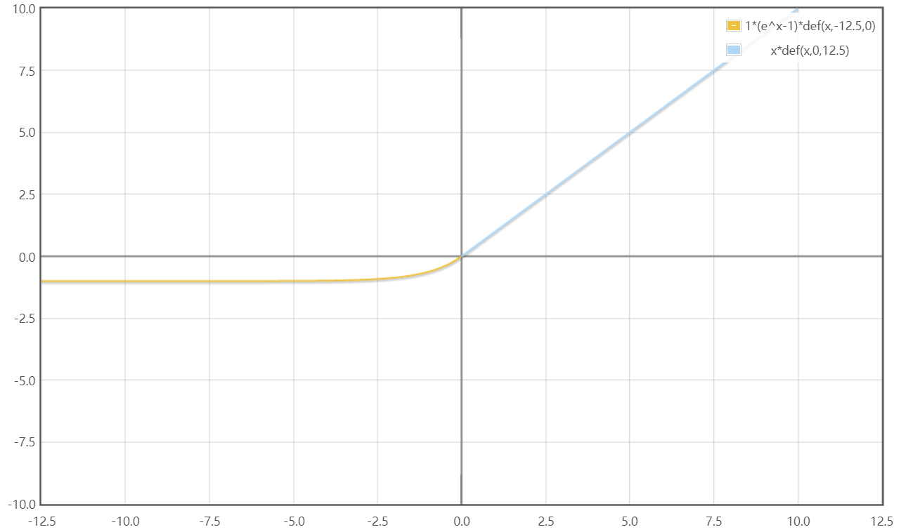

# 激活函数

## 需要解决的问题

什么是梯度爆炸、梯度消失？  
为什么梯度反向传播会变小0.25倍？  

## 参考文章
[画函数](https://zh.numberempire.com/graphingcalculator.php)

[常用激活函数（激励函数）理解与总结](https://blog.csdn.net/tyhj_sf/article/details/79932893)

## 目录
#### 一、介绍

#### 二、激活函数

[1. Sigmoid函数](#1-sigmoid函数)  
[2. tanh函数](#2-tanh函数)  
[3. ReLU函数](#3-relu函数)  
[4. Leaky ReLU函数](#4-leaky-relu函数)  
[5. ELU函数](#5-elu函数)  
[6. MaxOut函数](#6-maxout函数)  

#### 三、激活函数的使用

[如何选择激活函数](#如何选择激活函数)

# 一、介绍

## 什么是激活函数

神经网络中的每个神经元节点接受上一层神经元的输出值作为本神经元的输入值，并将输入值传递给下一层。在多层神经网络中，上层节点的输出和下层节点的输入之间具有一个函数关系，这个函数称为激活函数。

## 激活函数的用途

如果没有激活函数，每一层节点的输入都是上层输出的线性函数，并且整个网络的输出也是输入的线性组合，这中情况就是最原始的感知机，网络的逼近能力相当有限。在层与层之间引入非线性函数作为激活函数，能够使深层神经网络的表达能力更加强大。

# 二、激活函数

## 1. Sigmoid函数

数学公式：

$$f(x) = \frac{1}{1+e^{-x}}$$

几何图像：

**特点**：

它能够把输入的连续实值变换为0-1之间的输出。

缺点：

**缺点1**：在深度神经网络中梯度反向传递时导致梯度爆炸和梯度消失，其中梯度爆炸发生的概率非常小，而梯度消失发生的概率比较大。  
如果初始化神经网络的权值为 $[0,1]$ 之间的随机值，由反向传播算法的数学推到可知，梯度从后向前传播时，每传递一层梯度值都会减小为原来的0.25倍，如果神经网络隐藏层特别多，那么梯度在穿过多层后将变得非常小接近于0，即出现梯度消失现象；当网络 权值初始化为 $(1,+∞)$ 区间的值，则会出现梯度爆炸情况。

**缺点2**：Sigmod的输出不是0均值。这会导致后一层的神经元将得到上一层输出的非0均值的信号作为输入。产生的一个结果为：若 $x>0,f=w^Tx+b$，那么对 $w$ 求局部梯度则都为正，这样在反向传播的过程中 $w$ 要么都往正方向更新，要么都往负方向更新，使得收敛缓慢。不过，如果按batch去训练，由于一个batch可能得到不同的信号，这个问题会得到缓解

**缺点3**：含有幂运算，求解时相对耗时

## 2. tanh函数

数学公式：

$$tanh(x) = \frac{e^x - e^{-x}}{e^x + e^{-x}}$$

几何图像：

tanh函数解决了Sigmod函数非0均值输出的问题，但梯度消失和幂运算的问题仍然存在

## 3. ReLU函数

数学公式：

$$ReLU(x) = max(0,x)$$

几何图像：

优点：

**优点1**：解决了gradient vanishing（梯度消失）问题（在正区间）  
**优点2**：计算速度非常快，只需要判断输入是否大于0  
**优点3**：收敛速度远快于sigmoid和tanh  

缺点：

**缺点1**：ReLU的输出也不是zero-centered（0均值）  
**缺点2**：Dead ReLU Problem，指的是某些神经元可能永远不会被激活，导致相应的参数永远不能被更新。  
有两个主要原因：（1）非常不幸的参数初始化，这种情况非常少见。（2）learning rate太高导致在训练过程中参数更新太大，使网络进入这种状态。  
解决方法：采用Xavier初始化方法、避免将learning rate设置太大或者使用Adagrad等自动调节learning rate的算法。

## 4. Leaky ReLU函数

数学公式：

$$f(x) = max(\alpha x,x)$$

几何图像（$\alpha = 0.01$）：

为了解决Dead ReLU Problem，这里将ReLU前半段设置为 $\alpha x$ 而非0，通常 $\alpha=0.01$。

理论上来讲，Leaky ReLU有ReLU的所有优点，并且不会有Dead ReLU Problem，但是在实际使用中，并没有证明Leaky ReLU总是好于ReLU。

## 5. ELU函数

数学公式：

$$f(x)=\left\{\begin{array}{ll}
x, & \text { if } x>0 \\
\alpha\left(e^{x}-1\right), & \text { otherwise }
\end{array}\right.$$

几何图像：

ELU也是解决Dead ReLU Problem的，但和Leaky ReLU一样，实际使用中并没有很好证明ELU总是优于ReLU。

## 6. MaxOut函数

MaxOut是深度学习中的一层网络，可以把MaxOut看作网络中的激活函数层。假设网络某一层的输入特征向量为 $X=(x_1,x_2,...,x_d)$。MaxOut隐藏层每个神经元的计算公式如下：

$$h_{i}(x)=\max_{j \in[1, k]} z_{i j}$$

$$z_{ij} = x^TW_{...ij} + b_{ij}$$

其中k是人为设定的参数，W是一个大小为 $(d,m,k)$ 三维矩阵，b是一个大小为 $(m,k)$ 的二维矩阵，这两个是需要学习的参数。  
如果将参数k设为1，那么该网络就是普通的MLP网络。传统的MLP算法在第$i$层和第$i+1$层之间只有组参数，但在MaxOut中，我们在这一层同时训练n组w、b参数，然后选择激活值Z最大的作为下一层神经元的激活值。

# 三、激活函数的使用

## 如何选择激活函数

目前没有确切的方法。

1. 深度学习往往需要大量时间来处理数据，模型的收敛速度非常重要。总体来说，训练时尽量使用zero-centered数据（通过预处理实现）和zero-centered输出。所以要尽量选择输出具有zero-centered特点的激活函数来加快模型收敛速度。
2. 如果使用ReLU，则一定要小心设置learning rate，并且不要让网络出现很多“dead”神经元。如果不好解决，可以尝试使用Leaky ReLU、ELU等等。
3. 最好不要用sigmoid。