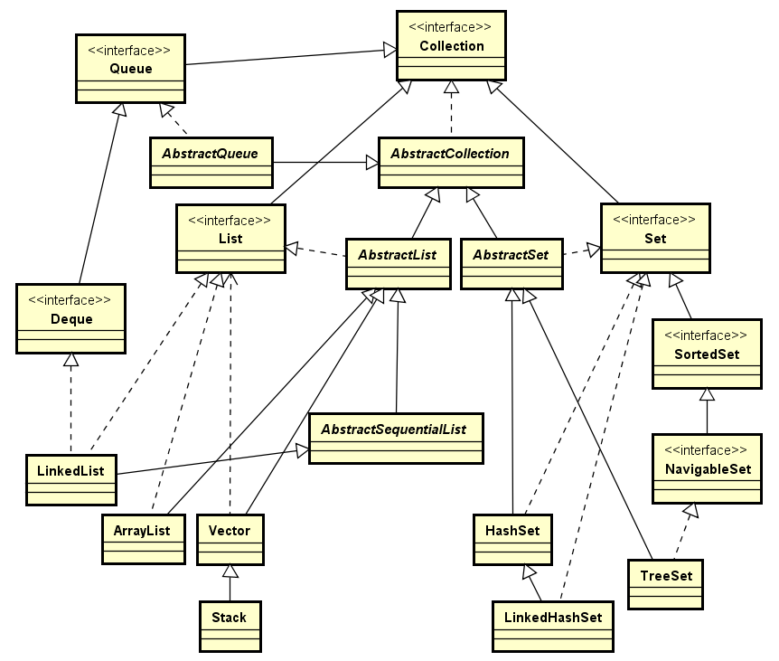
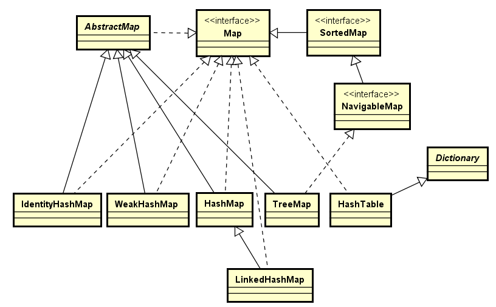

# Java容器与1.8源码分析

## 目录

* [一、概览](#一概览)
    * [Collection](#collection)
    * [Map](#map)
* [二、源码分析](#二源码分析)
    * [TreeSet](#TreeSet)
    * [TreeMap](#TreeMap)
* [三、参考资料](#三参考资料)

# 一、概览

容器主要包括 Collection 和 Map 两种，Collection 存储着对象的集合，而 Map 存储着键值对（两个对象）的映射表。

## Collection



### 1. Set

- TreeSet：基于红黑树实现，支持有序性操作，例如根据一个范围查找元素的操作。但是查找效率不如 HashSet，HashSet 查找的时间复杂度为 O(1)，TreeSet 则为 O(logN)。

- HashSet：基于哈希表实现，支持快速查找，但不支持有序性操作。并且失去了元素的插入顺序信息，也就是说使用 Iterator 遍历 HashSet 得到的结果是不确定的。

- LinkedHashSet：具有 HashSet 的查找效率，并且内部使用双向链表维护元素的插入顺序。

### 2. List

- ArrayList：基于动态数组实现，支持随机访问。

- Vector：和 ArrayList 类似，但它是线程安全的。

- LinkedList：基于双向链表实现，只能顺序访问，但是可以快速地在链表中间插入和删除元素。不仅如此，LinkedList 还可以用作栈、队列和双向队列。

### 3. Queue

- LinkedList：可以用它来实现双向队列。

- PriorityQueue：基于堆结构实现，可以用它来实现优先队列。

## Map



- TreeMap：基于红黑树实现。

- HashMap：基于哈希表实现。

- HashTable：和 HashMap 类似，但它是线程安全的，这意味着同一时刻多个线程同时写入 HashTable 不会导致数据不一致。它是遗留类，不应该去使用它，而是使用 ConcurrentHashMap 来支持线程安全，ConcurrentHashMap 的效率会更高，因为 ConcurrentHashMap 引入了分段锁。

- LinkedHashMap：使用双向链表来维护元素的顺序，顺序为插入顺序或者最近最少使用（LRU）顺序。

# 二、源码分析

如果没有特别说明，以下源码分析基于 JDK 1.8。

## TreeSet

* 基于TreeMap实现，支持自然排序和自定义排序(NavigableSet)，可以进行逆序输出
* 不允许null值
* 不是线程安全的，多线程环境下可以使用 ```SortedSet s = Collections.synchronizedSortedSet(new TreeSet(...));```

### 1. TreeSet的继承关系

```java
public class TreeSet<E> extends AbstractSet<E>
    implements NavigableSet<E>, Cloneable, java.io.Serializable
```

* 继承了抽象类AbstractSet，方便扩展
* 实现了一个NavigableSet接口，提供各种导航方法
* 实现了Cloneable接口，可以克隆
* 实现了Serializable接口，可以序列化

NavigableSet接口类

```java
public interface NavigableSet<E> extends SortedSet<E>
```

继承SortedSet接口，而SortedSet提供了一个返回比较器的方法

```java
Comparator<? super E> comparator();
```

支持自然排序和自定义排序。自然排序要求添加到Set中的元素实现Comparable接口，自定义排序要求实现一个Comparator比较器

### 2.关键点
TreeSet是如何保证元素不重复以及元素有序的（基于TreeMap实现）

```java
private transient NavigableMap<E,Object> m; // 保证有序

// Dummy value to associate with an Object in the backing Map
private static final Object PRESENT = new Object(); // 固定Value
```

```m``` 是用来保存元素的，不过 ```m``` 声明的是 ```NaviableMap``` 将 ```TreeMap``` 放在构造方法里实例化，让 TreeSet 更加灵活。 ```PRESENT``` 是作为固定Value值进行占位的

```add``` 和 ```remove``` 方法

```java
public boolean add(E e) {
    return m.put(e, PRESENT)==null;
}

public boolean remove(Object o) {
    return m.remove(o)==PRESENT;
}
```
利用Map保存的Key-Value键值对的Key不会重复的特点

### 3.构造函数

```java
TreeSet(NavigableMap<E,Object> m) {
    this.m = m;
}//以下方法中的this

public TreeSet() {
    this(new TreeMap<E,Object>());//默认自然排序
}

public TreeSet(Comparator<? super E> comparator) {
    this(new TreeMap<>(comparator));//自定义比较器
}

public TreeSet(Collection<? extends E> c) {
    this();//默认自然排序
    addAll(c);//将Collection中的元素添加到TreeMap中
}

public TreeSet(SortedSet<E> s) {
    this(s.comparator());//使用SortedSet比较器
    addAll(s);//将SortedSet中的元素添加到TreeMap中
}
```

跟踪addAll()方法

```java
public  boolean addAll(Collection<? extends E> c) {
    // Use linear-time version if applicable
    if (m.size()==0 && c.size() > 0 &&
        c instanceof SortedSet &&
        m instanceof TreeMap) {
        SortedSet<? extends E> set = (SortedSet<? extends E>) c;
        TreeMap<E,Object> map = (TreeMap<E, Object>) m;//将两个对象做类型转换
        Comparator<?> cc = set.comparator();
        Comparator<? super E> mc = map.comparator();
        if (cc==mc || (cc != null && cc.equals(mc))) {//保证set和map的比较器是一样的(idea让直接用equals判断？？？)
            map.addAllForTreeSet(set, PRESENT);//TreeMap中专门为TreeSet准备的方法
            return true;
        }
    }
    return super.addAll(c);
}
```

TreeMap中的 ```addAllForTreeSet``` 方法

```java
void addAllForTreeSet(SortedSet<? extends K> set, V defaultVal) {
    try {
        buildFromSorted(set.size(), set.iterator(), null, defaultVal);
    } catch (java.io.IOException | ClassNotFoundException cannotHappen) {
    }
}
```

```buildFromSorted``` 将传入的集合构造成一棵最底层的节点为红色，其它节点都是黑色的红黑树 [跳转TreeMap]()

### 4.迭代与输出

迭代器：

```java
public Iterator<E> iterator() {//迭代器
    return m.navigableKeySet().iterator();
}
```
逆序输出（逆序迭代）：

```java
public Iterator<E> descendingIterator() {
    return m.descendingKeySet().iterator();
}
```

倒排：

```java
public NavigableSet<E> descendingSet() {
    return new TreeSet<>(m.descendingMap());
}
```

### 5.返回子集的方法

返回的子集保留构造时的 ```边界限制``` (子集做增删时会继续判断限制)

```java
public NavigableSet<E> subSet(E fromElement, boolean fromInclusive, E toElement, boolean toInclusive) {
    //两元素大小之间的子集
    return new TreeSet<>(m.subMap(fromElement, fromInclusive, toElement, toInclusive));
}

public NavigableSet<E> headSet(E toElement, boolean inclusive) {//最大值为toElement的子集
    return new TreeSet<>(m.headMap(toElement, inclusive));
}

public NavigableSet<E> tailSet(E fromElement, boolean inclusive) {
    return new TreeSet<>(m.tailMap(fromElement, inclusive));
}

public SortedSet<E> subSet(E fromElement, E toElement) {
    return subSet(fromElement, true, toElement, false);
}

public SortedSet<E> headSet(E toElement) {
    return headSet(toElement, false);
}

public SortedSet<E> tailSet(E fromElement) {
    return tailSet(fromElement, true);
}
```

### 6.导航方法

实现 ```NavigableSet``` 中的导航方法：调用m(NavigableMap)对应的方法

```java
public E first() {
    return m.firstKey();//返回第一个元素
}

public E last() {
    return m.lastKey();//返回最后一个元素
}

// NavigableSet API methods
public E lower(E e) {
    return m.lowerKey(e);//返回小于e的第一个元素
}

public E floor(E e) {
    return m.floorKey(e);
}

public E ceiling(E e) {
    return m.ceilingKey(e);
}

public E higher(E e) {
    return m.higherKey(e);
}

public E pollFirst() {//弹出第一个元素
    Map.Entry<E,?> e = m.pollFirstEntry();
    return (e == null) ? null : e.getKey();
}

public E pollLast() {//弹出最后一个元素
    Map.Entry<E,?> e = m.pollLastEntry();
    return (e == null) ? null : e.getKey();
}
```

### 7.其他常见方法

```java
public int size() {
    return m.size();
}

public boolean contains(Object o) {
    return m.containsKey(o);
    //可以看到返回的是m存储的key
}

public void clear() {
    m.clear();
}
```
[返回目录](#目录)

## TreeMap

* TreeMap基于红黑树（Red-Black tree）实现。该映射根据其键的自然顺序进行排序，或者根据创建映射时提供的 Comparator 进行排序，具体取决于使用的构造方法。
* TreeMap的基本操作 containsKey、get、put 和 remove 的时间复杂度是 log(n) 。
* TreeMap是非同步的。 它的iterator 方法返回的迭代器是fail-fastl的。0

### 1. TreeSet的继承关系

```java
public class TreeMap<K,V>
    extends AbstractMap<K,V>
    implements NavigableMap<K,V>, Cloneable, java.io.Serializable
```

* 继承了抽象类AbstractMap，所以它是一个Map，即一个key-value集合
* 实现了一个NavigableMap接口，提供各种导航方法
* 实现了Cloneable接口，可以克隆
* 实现了Serializable接口，可以序列化

NavigableSet接口类

```java
public interface NavigableMap<K,V> extends SortedMap<K,V>
```

继承SortedMap接口，而SortedMap提供了一个返回比较器的方法

```java
Comparator<? super E> comparator();
```

支持自然排序和自定义排序。自然排序要求添加到Set中的元素实现Comparable接口，自定义排序要求实现一个Comparator比较器

### 2.数据结构

```java
private final Comparator<? super K> comparator;//比较器
private transient Entry<K,V> root;//Map存储的节点
private transient int size = 0;//存储的上限
private transient int modCount = 0;//存储的个数
```

红黑树相关

```java
private static final boolean RED   = false;
private static final boolean BLACK = true;
static final class Entry<K,V> implements Map.Entry<K,V>{...}
```

具体方法，学习了红黑树再研究

### 3.构造函数

```java
//默认构造函数，使用java的默认比较器比较key的大小
public TreeMap() {
    comparator = null;
}
//带比较器的构造函数
public TreeMap(Comparator<? super K> comparator) {
    this.comparator = comparator;
}
//带Map的构造函数，Map会称为TreeMap的子集
public TreeMap(Map<? extends K, ? extends V> m) {
    comparator = null;
    putAll(m);
}
//带SortedMap的构造函数，SortedMap会成为TreeMap的子集
public TreeMap(SortedMap<K, ? extends V> m) {
    comparator = m.comparator();
    try {
        buildFromSorted(m.size(), m.entrySet().iterator(), null, null);
    } catch (java.io.IOException cannotHappen) {
    } catch (ClassNotFoundException cannotHappen) {
    }
}
```
带有Map和SortedMap的构造函数，创建TreeMap使用的方法是不一样的。因为Map不是有序的，需要一个一个地添加，而SortedMap是有序的Map，通过buildFromSorted方法创建

跟踪putAll()方法

```java
public void putAll(Map<? extends K, ? extends V> map) {
    int mapSize = map.size();
    if (size==0 && mapSize!=0 && map instanceof SortedMap) {
        Comparator<?> c = ((SortedMap<?,?>)map).comparator();
        if (c == comparator || (c != null && c.equals(comparator))) {
            ++modCount;
            try {
                buildFromSorted(mapSize, map.entrySet().iterator(), 
                                null, null);
            } catch (java.io.IOException cannotHappen) {
            } catch (ClassNotFoundException cannotHappen) {
            }
            return;
        }
    }
    super.putAll(map);
}
```

跟踪buildFromSorted方法

```java
private void buildFromSorted(int size, Iterator<?> it, java.io.ObjectInputStream str, V defaultVal) throws  java.io.IOException, ClassNotFoundException {
    this.size = size;
    root = buildFromSorted(0, 0, size-1, computeRedLevel(size), it, str, defaultVal);
}

// 将map中的元素逐个添加到TreeMap中，并返回map的中间元素作为根节点
private final Entry<K,V> buildFromSorted(int level, int lo, int hi,
                                         int redLevel,
                                         Iterator<?> it,
                                         java.io.ObjectInputStream str,
                                         V defaultVal)
    throws java.io.IOException, ClassNotFoundException {

    if (hi < lo) return null;
    // 获取中间元素
    int mid = (lo + hi) >>> 1;

    Entry<K,V> left  = null;
    // 如果lo小于mid，则递归调用获取middle的左孩子
    if (lo < mid)
        left = buildFromSorted(level+1, lo, mid - 1, redLevel,
                                it, str, defaultVal);

    // extract key and/or value from iterator or stream
    K key;
    V value;
    if (it != null) {
        if (defaultVal==null) {
            Map.Entry<?,?> entry = (Map.Entry<?,?>)it.next();
            key = (K)entry.getKey();
            value = (V)entry.getValue();
        } else {
            key = (K)it.next();
            value = defaultVal;
        }
    } else { // use stream
        key = (K) str.readObject();
        value = (defaultVal != null ? defaultVal : (V) str.readObject());
    }
    //创建
    Entry<K,V> middle =  new Entry<>(key, value, null);

    // color nodes in non-full bottommost level red
    if (level == redLevel)
        middle.color = RED;

    if (left != null) {
        middle.left = left;
        left.parent = middle;
    }

    if (mid < hi) {
        Entry<K,V> right = buildFromSorted(level+1, mid+1, hi, redLevel,
                                            it, str, defaultVal);
        middle.right = right;
        right.parent = middle;
    }

    return middle;
}
```

### 4.迭代与输出

迭代器：

```java
public Iterator<E> iterator() {//迭代器
    return m.navigableKeySet().iterator();
}
```
逆序输出（逆序迭代）：

```java
public Iterator<E> descendingIterator() {
    return m.descendingKeySet().iterator();
}
```

倒排：

```java
public NavigableSet<E> descendingSet() {
    return new TreeSet<>(m.descendingMap());
}
```

### 5.返回子集的方法

返回的子集保留构造时的 ```边界限制``` (子集做增删时会继续判断限制)

```java
public NavigableSet<E> subSet(E fromElement, boolean fromInclusive, E toElement, boolean toInclusive) {
    //两元素大小之间的子集
    return new TreeSet<>(m.subMap(fromElement, fromInclusive, toElement, toInclusive));
}

public NavigableSet<E> headSet(E toElement, boolean inclusive) {//最大值为toElement的子集
    return new TreeSet<>(m.headMap(toElement, inclusive));
}

public NavigableSet<E> tailSet(E fromElement, boolean inclusive) {
    return new TreeSet<>(m.tailMap(fromElement, inclusive));
}

public SortedSet<E> subSet(E fromElement, E toElement) {
    return subSet(fromElement, true, toElement, false);
}

public SortedSet<E> headSet(E toElement) {
    return headSet(toElement, false);
}

public SortedSet<E> tailSet(E fromElement) {
    return tailSet(fromElement, true);
}
```

### 6.导航方法

实现 ```NavigableSet``` 中的导航方法：调用m(NavigableMap)对应的方法

```java
public E first() {
    return m.firstKey();//返回第一个元素
}

public E last() {
    return m.lastKey();//返回最后一个元素
}

// NavigableSet API methods
public E lower(E e) {
    return m.lowerKey(e);//返回小于e的第一个元素
}

public E floor(E e) {
    return m.floorKey(e);
}

public E ceiling(E e) {
    return m.ceilingKey(e);
}

public E higher(E e) {
    return m.higherKey(e);
}

public E pollFirst() {//弹出第一个元素
    Map.Entry<E,?> e = m.pollFirstEntry();
    return (e == null) ? null : e.getKey();
}

public E pollLast() {//弹出最后一个元素
    Map.Entry<E,?> e = m.pollLastEntry();
    return (e == null) ? null : e.getKey();
}
```

### 7.其他常见方法

```java
public int size() {
    return m.size();
}

public boolean contains(Object o) {
    return m.containsKey(o);
    //可以看到返回的是m存储的key
}

public void clear() {
    m.clear();
}
```


[返回目录](#目录)

# 三、参考资料

总体结构：
* https://github.com/CyC2018/CS-Notes/blob/master/notes/Java%20%E5%AE%B9%E5%99%A8.md

TreeSet
* Java常用数据结构之Set之TreeSet：https://juejin.im/post/5bfb6d8ff265da610e7fc2da

TreeMap
* https://www.cnblogs.com/skywang12345/p/3310928.html