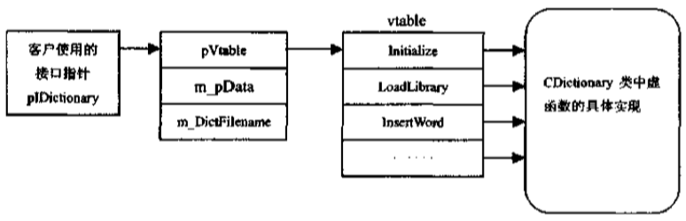
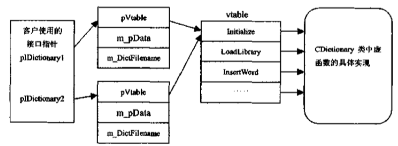
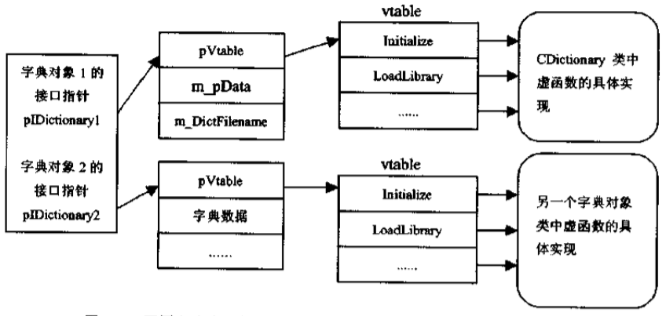

# 目录
- [第一章概述](#第一章概述)
    - [1.COM的起源](#1.COM的起源)
        - [a.OLE的发展历史](#a.OLE的发展历史)
        - [b.组件的产生](#b.组件的产生)
        - [c.面向对象的组件模型——COM](#c.面向对象的组件模型——COM)
    - [2.COM结构](#2.COM结构)
        - [a.对象与接口](#a.对象与接口)
        - [b.客户/服务器模型](#b.客户/服务器模型)
        - [c.COM库](#c.COM库)
    - [3.COM特性](#3.COM特性)
        - [a.语言无关性](#a.语言无关性)
        - [b.进程透明性](#b.进程透明性)
        - [c.可重用性](#c.可重用性)
- [第二章COM对象和接口](#第二章COM对象和接口)
    - [1.COM对象](#1.COM对象)
        - [a.COM对象的标识——CISD](#a.COM对象的标识——CISD)
        - [b.COM对象与C++对象的比较](#b.COM对象与C++对象的比较)
    - [2.COM接口](#2.COM接口)
        - [a.从API到COM接口](#a.从API到COM接口)
        - [b.接口定义和标识](#b.接口定义和标识)
        - [c.用C++语言定义接口](#c.用C++语言定义接口)
        - [d.接口描述语言IDL](#d.接口描述语言IDL)
        - [e.接口的内存模型](#e.接口的内存模型)
        - [f.接口的一些特点](#f.接口的一些特点)
    - [3.IUnknown接口](#3.IUnknown接口)
        - [a.引用计数](#a.引用计数)
        - [b.实现引用计数](#b.实现引用计数)
        - [c.使用引用计数规则](#c.使用引用计数规则)
        - [d.接口查询](#d.接口查询)
        - [e.COM对象的接口原则](#e.COM对象的接口原则)
        - [f.QueryInterface成员函数的实现](#f.QueryInterface成员函数的实现)
        - [g.COM对象和接口图示法](#g.COM对象和接口图示法)
    - [4.字典组件例子程序](#4.字典组件例子程序)
        - [a.组件程序DictComp](#a.组件程序DictComp)
        - [b.客户程序DictCtrl](#b.客户程序DictCtrl)
- 第三章COM的实现
    - 进程内组件和进程外组件
        - 进程内组件
        - 进程外组件
    - 通过注册表管理COM对象
        - 注册表结构
        - COM组件注册信息
        - COM组件的注册操作
    - 类厂
        - 类厂和DllGetObjectClass函数
        - COM库与类厂的交互
        - 类厂的实现
        - 类厂对组件生存期的控制
    - COM库
        - COM库的优化
        - COM库的内存管理
        - 组件程序的装在和卸载
        - 常用函数和HHRESULT
    - COM实现过程
        - 进程内组件与客户的协作过程
        - 进程外组件与客户的协作过程
    - 字典组件例子程序的实现
        - 字典组件类厂的实现
        - 字典对象的实现
        - 全局引出函数的实现
        - 客户程序DictCtrl
- 第四章COM特性
    - 可重用性：包容和聚合
        - 包容和聚合
        - 包容实现
        - 聚合实现
        - 聚合例子程序
    - 进程透明性
        - 列集(marshaling)
        - 自定义列集
        - 标准列集
        - 标准列集的实现
        - 进程外组件例子程序
    - 安全性
        - Windows NT安全机制
        - 激活安全性
        - 调用安全性
    - 多线程特性
        - Win32线程和COM线程
        - 列集和同步
        - 套间进程
        - 自由进程
        - 进程内组件的线程模式


# 第一章概述
COM，即组件对象模型，是一种以组件为发布单元的对象模型，这种模型使各种软件组件可以用一种同意的方式进行交互。
## 1.COM的起源
### a.OLE的发展历史
OLE（obiect linking and embedding）对象链接和嵌入  
OLE1基于动态数据交换(DDE，Dynamic Data Exchange)机制，效率，稳定性不好，使用也不够方便  
OLE2基于COM，OLE模块定制和扩充变得非常方便  
版本升级时，可以单独升级模块
### b.组件的产生
把一个庞大的程序分成多个模块，每一个模块保持一定的功能独立性，在协同工作时，通过相互之间的接口完成实际的任务，我们把每一个这个的模块称为组件  
组件可以单独开发，单独编译，甚至单独调试和测试
### c.面向对象的组件模型——COM
组件模块为COM对象提供了活动的空间，COM对象以接口的方式提供服务。  
在Windows平台上，一个COM组件或者是一个DDL(dynamin linking library动态链接库)或者是一个EXE(可执行)文件  

## 2.COM结构
COM标准包括规范和实现两大部分，规范不扽定义了组件和组件之间的通信机制，这些规范不依赖于任何特定的语言和操作系统，只要按照该规范，任何语言都可使用；COM标准的实现部分是COM库，COM库为COM规范的实现提供了一些核心服务
### a.对象与接口
每一个接口都由一个位的全局唯一标识符GUID(gloablly unique identifier)来标识  
每个对象也用一个位GUID来标识，称为CLSID(class identitier)  
只要系统中含有这类COM对象的信息，包括COM对象所在的模块文件以及COM对象在代码中的入口点，客户程序就可以由CLSID创建COM对象  
创建COM对象后，得到的是一个指向对象某个接口的指针，根据COM规范，一个COM对象如果实现了多个接口，则可以从某个接口得到该对象的任意其他接口  
COM对象可以有其自己的状态
### b.客户/服务器模型
模型的优点  
* 稳定性、可靠性好：任务分离，客户和服务器各司其职
* 软件的可扩展性更好：一个服务器可以处理多个用户请求，用户请求可以分配给不同的服务器
* 提高性能：可以根据服务器配置不同分配不同的任务
* 在网络上实现时，可以降低网络流量。在网络上只传输客户和服务程序所关心的数据  
* 用于数据库时，可以实现事务机制
### c.COM库
库包含以下内容
* 提供了少量的API函数实现客户和服务器端COM应用的创建过程
* 通过注册表查找本地服务器即exe程序，以及程序名与CISID的转换
* 提供了一种标准的控制方法，使应用控制进程中内存的分配  
COM库是操作系统层次上实现的，因此一个操作系统只有一个COM库  
## 3.COM特性
### a.语言无关性
COM规范的定义不依赖于特定的语言
### b.进程透明性
对象服务程序的区分
* 进程内服务程序：服务程序被加载到客户的进程空间，以DDL的形式实现
* 本地服务程序：服务程序和客户程序运行在同一台机器上，通常是一个EXE文件
* 远程服务程序：服务程序运行在与客户不同的机器上，可以是DDL也可以是EXE  
进程内模型优点是效率高，但组件不稳定会引起客户进程奔溃；进程外模型的优点是稳定性好，不会危及客户程序，但进程外组件开销大，调用效率低  
调用远程服务程序时，COM库会在酷虎进程中创建代理对象，客户程序直接与代理对象进行交互
### c.可重用性
实现机制：
* 包容方式：对象1包含对象2，对象1在实现接口时实际上调用对象2的接口
* 聚合方式：对象1只是简单地把对象2地接口暴露给用户程序


# 第二章COM对象和接口
## 1.COM对象
### a.COM对象的标识——CISD
128位随机数字  
随机性由两方面特性保证：空间即网络适配器的地址值(没有的话就随机数生成)，另一方面是时间值
Mircosoft Visual C++提供了两个工具：UUIDGen.exe和GUIDGen.exe  
COM库提供以下API
```c
HRESULT CoCreateGuid(GUID *pguid);
// 创建成功返回S_OK，pguid指向GUID值
```
### b.COM对象与C++对象的比较
* 封装特性  
两者都具有，但形式不同  
COM的数据完全封装在内部，外部不可能直接访问对象的数据属性  
C++有不同等级：public,protected,private
* 可重用性
两者的共同特性，但表现形式不同  
COM的可重用性表现在包含和聚合。  
C++的可重用性表现在继承  
COM对象可以完全宠用B对象的功能，即使对象B更新，对象A也不需要重新编译或者重新设置，但C++对象的重用性表现在源代码一级，需要重新编译甚至修改代码来使用对象B的新特性
## 2.COM接口
### a.从API到COM接口
平面型API接口层(多调用1)可以很好地把两个程序连接起来，但存在以下问题：
* 当API函数非常多时，使用会非常不方便，需要对函数进行组织
* API函数需要标准化，按照统一的调用方式进行处理，以适应不同的语言编程实现。参数的传递顺序、参数类型、函数返回处理都需要标准化
### b.接口定义和标识
接口指针实际上指向另一个指针，着第二个指针指向一组函数，称为接口函数表，接口函数表中每一项为4字节厂的函数指针，每个函数指针与对象的具体实现连接起来。客户只要获得接口指针，就可以调用到对象的实际功能  
通常，把接口函数表称为虚函数表(vtable)，指向vtable的指针为pVtable
使用C语言描述字典接口
```c
struct IDictionaryVtbl;
struct Idictionary;
{
    IDictionaryVtble *pVtbl;
};
struct IDictionaryVtbl{
    BOOL (* Initialize)(IDictionary *this);
    BOOL (* LoadLibrary)(IDictionary *this,String);
    BOOL (* InsertWord)(IDictionary *this,String,String);
    void (* DeleteWord)(IDictionary *this),String;
    BOOL (* LookupWord)(IDictionary *this,String,String *);
    BOOL (* RestoreLibrary)(IDictionary *this,String);
    void (* FreeLibrary)(IDictionary *this);
}
```
需要说明的内容
* 每个接口成员函数的第一个指针为指向IDictionary的指针，类似于C————中被隐藏的this指针
* 在接口成员函数中，字符串变量必须用Unicode字符指针  
一个COm对象可以支持很多个接口，例如不仅支持IDictionary接口，还可以支持拼写检查ISpellCheck接口。客户程序通过一个全局唯一标识符标识接口，称为接口标识符IID
### c.用C++语言定义接口
使用C++定义IDictionary
```c++
class IDictionary
{
    virtual BOOL Initialize()=0;
    virtual BOOL LoadLibrary(String)=0;
    virtual BOOL InsertWord(String,String)=0;
    virtual void DeleteWord(String)=0;
    virtual BOOL LookupWord(String,String)=0;
    virtual BOOL RestoreLibrary(String)=0;
    virtual void FreeLibrary()=0;

};
```
C++的class隐藏了虚函数表vtable，并且每个成员函数隐藏了第一个参数this指针  
C++调用接口成员函数
```C++
pIDictionary->LoadLibrary("Eng-Ch.dict")
```
C调用接口成员函数
```C
pIDictionary->pVtbl->LoadLibrary(pIDictionary,"Eng-Ch.dict");
```
### d.接口描述语言IDL
接口描述语言提供了一种不依赖于任何语言的接口描述方法，因此，它可以称为组件程序和客户程序之间的共同语言  
用IDL描述接口IDictionary
```c
interface IDictionary
{
    HRESULT Initialize();
    HRESULT LoadLibrary([in]string);
    HRESULT InsertWord([in]string,[in]string);
    HRESULT DeleteWord([in]string);
    HRESULT LookupWord([in]string,[out]string *);
    HRESULT RestoreLibrary([in]string);
    HRESULT FreeLibrary();
};
```
### e.接口的内存模型
虽然每个成员函数的第一个参数是一个指向接口自身的this指针，但this指针如何于对象的状态信息联系起来  
COM对象往往有自己的属性数据，这些属性数据反映了对象的状态  
用C++语言实现字典对象
```c++
class CDictionary:public IDictionary
{
    public:
        CDictionary();
        ~CDictionary();
    public:
        virtual BOOL Initialize();
        virtual BOOL LoadLibrary(String);
        virtual BOOL InsertWord(String,String);
        virtual void DeleteWord(String);
        virtual BOOL LookupWord(String,String);
        virtual BOOL RestoreLibrary(String);
        virtual void FreeLibrary();
    private:
        struct DictWord *m_pData;
        char *m_DictFilename[128];
    private:
        //other private helper function
};
```
接口IDictionary和字典对象的内存结构为

如果一个客户使用了两个字典对象，则显然两个字典对象公用了成员函数，但数据属性是不能公用的，内存结构如下：

如果第二个字典组件没有采用CDictionary类的接口来实现字典，那么内存结构为：

### f.接口的一些特点
* 二进制特性  
接口规范规定了二进制一级的标准。任何语言只要有足够的数据表达能力就可以对接口进行描述
* 接口不变性  
如果接口发生变化，那么客户程序和组件程序也要跟着发生变化，对于应用系统的开发非常不利，不符合组件话程序设计的思想
* 继承性(可扩展性)  
COM接口具有不变性，但也需要发展，类似于C++中类的继承。类继承不仅是说明继承，也是实现继承，但接口继承只是说明继承(接口定义不包括函数实现部分);类继承允许多重继承，接口继承只允许单继承
* 多态性-运行过程中的多态性  
多态性通过COM接口体现
## 3.IUnknown接口
COM定义的每个接口都必须继承IUnknown接口，因为IUnknown接口提供了两个非常重要的特性：生存期控制和接口查询  
客户程序只能通过接口与COM对象进行通信，如果客户还要操作对象，那对象需要仍存在内存中，如果客户操作完成，需要即时把对象释放掉。IUnknown引入了"引用计数"方法，有效地控制对象地生存周期  
如果一个对象实现了多个接口，在初始时刻，客户程序不太可能得到对象的所有接口指针，它只会拥有一个接口指针，IUnknown使用了"接口查询"的方法完成接口之间的跳转  
IUnknown的IDL定义
```c
interface IUnknown
{
    HRESULT QueryInterface([in] REFIID iid,[out] void * *ppv);
    ULONG AddRed(void);
    ULONG Release(void);
};
```
IUnknown的C++定义
```c++
class IUnknown
{
    public:
    virtual HRESULT _stdcall QueryInterface(const IID& iid,void * *ppv)=0;
    virtual ULONG _stdcall AddRef()=0;
    virtual ULONG _stacall Release()=0;
}
```
### a.引用计数
计数器
COM对象多一个引用，其计数值+1
### b.实现引用计数
有三种粒度：组件级，对象级，接口级  
如果使用后两者，需要增加对前者的计数
### c.使用引用计数规则
这里没弄明白(54页)
- 函数的参数中使用接口指针变量
    - 输入参数  
    输入参数在被调用函数执行过程中，不会被改变(传值参数)。在被调用函数中，不必调用AddRef和Release函数
    - 输出参数  
    输出参数会在函数执行过程中进行赋值并且不会使用该值，相当于函数的返回值。被调用函数返回之前，应该带哦用AddRef使接口引用计数+1
    - 输入-输出参数  
    参数修改之前，原来的接口指针-1，参数修改之后，新的接口指针变量+1
- 局部接口指针变量  
不用调用增减函数，因为在局部函数块中，接口指针总是有效的
- 全局接口指针变量  
全局接口指针作为参数传递之前，调用Addref，函数返回之后调用Release
- C++中类成员变量为接口指针变量  
相当于全局变量
- 一般性规则  
如果要对一个接口指针变量复制，复制后的接口指针变量调用AddRef，如果赋值前的接口指针变量还没有结束，则赋值前必须对它调用Release以便先结束它的使用
### d.接口查询
```c
HRESULT QueryInterface([in] REFIID iid,[out]void * *ppv);
```
返回值为32位整数，有三种情况
- S_OK，查到指定的接口
- E_NOINTERFACE，对象不支持所指定的接口，* ppv为NULL
- E_UNECPECTED，发生意外错误，*ppv为NULL  
### e.COM对象的接口原则
- 对于同一个对象的不同接口指针，查询得到的IUnknown接口必须完全相同
- 接口对称性。对一个接口查询其自身总应该成功
- 接口自反性
- 接口传递性
- 接口查询时间无关性
### f.QueryInterface成员函数的实现
### g.COM对象和接口图示法
## 4.字典组件例子程序
### a.组件程序DictComp
### b.客户程序DictCtrl