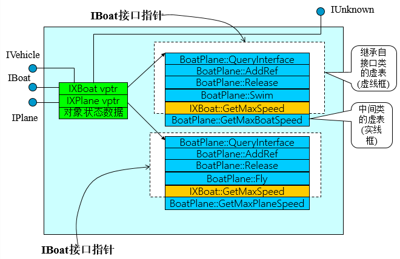
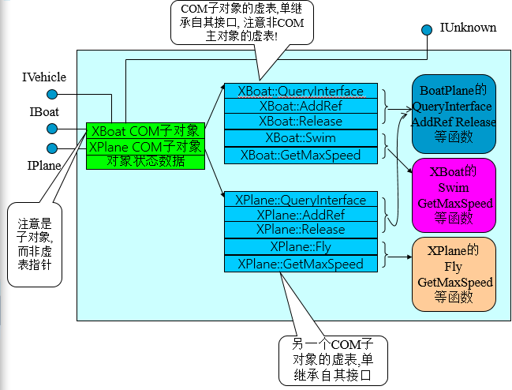

# 目录
- [零 介绍](#零-介绍)
- [一 分布式计算概述](#一-分布式计算概述)
- [二 C++预备知识](#二-C++预备知识)
- [三 从C++到COM](#三-从C++到COM)
- [四 COM接口](#四-COM接口)
- [五 COM对象](#五-COM对象)
- [六 接口的其他实现方法](#六-接口的其他实现方法)
- [七 重用模型](#七-重用模型)
- [八 MFC对COM的支持](#八-MFC对COM的支持)
- [九 ALT对COM的支持](#九-ALT对COM的支持)
- [十 跨进程特性](#十-跨进程特性)
- [十一 多线程模型](#十一-多线程模型)
- [十二 DCOM](#十二-DCOM)
- [十三 自动化对象](#十三-自动化对象)
- [十四 可连接对象](#十四-可连接对象)
- [十五 结构化存储](#十五-结构化存储)
- [十六 名字对象](#十六-名字对象)
- [十七 统一数据传输](#十七-统一数据传输)
- [十八 ActiveX](#十八-ActiveX)
- [十九 COM++](#十九-COM++)
- [二十 .Net和COM的交互性](#二十-.Net和COM的交互性)


# 零 介绍
略
# 一 分布式计算概述
# 二 C++预备知识
# 三 从C++到COM
## 1.源代码重用
## 2.动态链接库
### 2.1输出类
使用vc.net建立一个动态链接库，输出符号。把FastString的所有方法从DLL中引出去
```c++
//faststring.h
Class __declspec(dllexport)  FastString
{	char * m_psz;
public:
	FastString( char*psz);
	~FastString(void);
	int Length(void);
	int Find( char*psz);
};
//__declspec(dllexport) 是C++编译器指示符, 它通知编译器, 此类的所有成员方法都将对外输出
//FastString的所有方法都将被加载到dll的引出表中。允许在运行时把每个方法的名字解析到内存中对应的地址
```
在vc.net中可以成功调用
```c++
FastString * pf=new FastString("fdfd33");
pf->Length();
```
但是在bc中调用失败，提示，构造函数名字被改变，因此无法成功链接
### 2.2构造函数
为了消除构造函数被改变带来的依赖性，组件输出一个CreateObject函数
```c++
//faststring.h
extern "C" __declspec(dllexport) FastString* CreateObject(char *psz);

//faststring.cpp
FastString* CreateObject(char*psz)
{return new FastString(psz);}
```
客户端代码改为
```c++
FastString * pf=CreateObject("fdfd33");
pf->Length();
```
但是Length函数被名字改编  
为了消除编译器的依赖性。把这些功能函数做成虚函数
### 2.3虚函数
普通函数是解析名字来进行。调用虚函数是根据虚表指针进行的。
```c++
class  __declspec(dllexport) FastString{
	char * m_psz;//保存原始的字符串
public:
	FastString( char*psz);//构造函数
	~FastString(void);
	virtual int  Length(void);//返回该字符串的长度
	virtual int  Find( char*psz);//查找指定的子串
};
extern "C" __declspec(dllexport)FastString* CreateObject(char *psz);
```
### 2.4调用习惯
参数入栈方向：__stdcall从右往左，__cdecl从左往右，多数使用__stdcall
```c++
class  __declspec(dllexport)  FastString{
	char * m_psz;//保存原始的字符串
public:
	FastString( char*psz);//构造函数
	~FastString(void);
	virtual int __stdcall Length(void);//返回该字符串的长度
	virtual int __stdcall Find( char*psz);//查找指定的子串
};
extern "C" __declspec(dllexport)FastString* __stdcall CreateObject(char *psz);
```
所有被bc调用的函数声明为__stdcall
## 3.数据敏感性
略
## 4.接口与实现的分离
降低耦合度，抽象类只描述功能，不涉及实现方法，更不涉及到数据  
接口与实现类的关系
- 定义实现类要实现的公共操作为纯虚函数
- 接口类只包含有方法，没有数据
- 实现类从接口类中派生。实现基类的纯虚函数
- 用户面对接口类来进行各种操作。实现类对用户不可见
服务器端新定义一个类：
```c++
// IFaString.h
class IFastString
{
public:
	IFastString(void);
	~IFastString(void);
	virtual int __stdcall Length(void)=0;//返回该字符串的长度
	virtual int __stdcall Find(char*psz)=0;//查找指定的子串
};
extern "C"__declspec(dllexport) IFastString* __stdcall CreateObject(char *psz);
//改变CreateObject返回值：
```
实现类从接口类派生
```c++
实现类从接口类派生。
//vccom.h
#include ".\IFaststring.h"
class   FastString :public IFastString
{	public:
	char * m_psz;//保存原始的字符串
	FastString(char*psz);//构造函数
     ~FastString(void);
	virtual int __stdcall Length(void);//返回该字符串的长度
	virtual int __stdcall Find(char*psz);//查找指定的子串	
};
//vccom.cpp
IFastString* __stdcall CreateObject(char* psz)
{return new FastString(psz);}
```
实现类对客户端隐藏
```c++
#include "IFastString.h"
void f()
{
	IFastString * pf=CreateObject("fdfd33e");
	cout<<pf->Length ()<<endl;
}
```
不再具有数据敏感性
### 4.1析构函数
对于有继承层次的类，其基类的析构函数一般应定义为虚拟的。否则可能会出现内存泄漏
- 基类和子类可能都需要分配内存
- 为了实现多态的调用，我们一般针对基类指针进行操作
- 使用基类进行删除，只能调用基类的析构
- 子类的内存将无法释放

使用虚拟析构函数则可以避免内存泄漏
- 基类的析构函数声明为虚拟的，这样子类的析构函数也是虚的,并且被改写为释放实现子类分配的内存
- 通过基类指针进行释放时,由于基类指针指向的是子类的对象,所以调用的是子类的析构函数

子类的析构函数的执行顺序为
1. 子类本身的析构函数
2. 对象成员的析构函数
3. 基类的析构函数

因此派生类析构函数将递归地激活基类的析构函数.通过这样的方法可以完整地释放派生类对象所占用的存储空间
```c++
class  __declspec(dllexport) 
   IFastString
{
public:
	IFastString(void);
	virtual ~IFastString(void);
	virtual int __stdcall Length(void)=0;//返回该字符串的长度
	virtual int __stdcall Find(char*psz)=0;//查找指定的子串
};
```
vc客户端内存泄漏消失
### 4.2虚析构函数
但是以上代码在bc客户端会再次发生链接失败  
原因：因为虚析构函数在虚表中的位置随着编译器的不同而不同。使用A编译器编译出来的DLL中的对象,在B编译器中使用一个指向此对象的指针去调用其虚的析构函数时, 由于两种编译器对于虚析构函数的位置的理解不一致, B编译器不能在预期的位置找到析构函数,因此仍然会造成链接失败  
因此，仿照CreateObject去代替构造函数的方法，给类添加一个Delete函数，在Delete函数中删除对象
```c++
class IFastString
{
public: 
    virtual void Delete()=0;
    virtual int _stdcall Length(void)=0;
    virtual int _stdcall Find( char*psz)=0;	   	  
};
//子类
class   FastString：public IFastString
{
	char * m_psz;//保存原始的字符串	
public:
	FastString( char*psz);//构造函数
     ~FastString(void);
	virtual void __stdcall Delete(void);
     virtual int __stdcall Length(void);//返回该字符串的长度
	virtual int __stdcall Find( char*psz);//查找指定的子串
};
//Delete实现
void FastString::Delete ()
{delete this;}
```
Dll的四个文件：接口类的声明和实现，实现类的声明和实现，只有接口类的声明需要提供给客户。  
Dll只引出一个函数CreateObject  

客户的使用方法(bc下)  
静态加载，项目加入FaseString.lib引入文件
```c++
#include "IFastString.h"//客户需要接口类的声明文件.
IFastString *pIFS=CreateObject("abcd");//创建一个实现类的实例,用一个接口类的指针指向它.
pIFS->Find("a");//通过接口类来调用实现类的功能
pIFS->Delete();//释放内存
```
动态加载
```c++
IFastString *pIF;
HANDLE h;
h=LoadLibrary("FastString.dll");
if(h==NULL){ShowMessage("load err");return;}
typedef IFastString *(__stdcall *PF)(char *);
PF pf;
pf=(PF)GetProcAddress(h,"CreateObject");
pIF= pf("abcd");//或pIF=(*pf)(“abcd”);
pIF ->Length();//……使用接口
pIF->Find(“a”);
pIF->Delete();
FreeLibrary(h);
```
## 5.对象的扩展性
### 5.1功能扩展的需求
在接口类定义不变的情况下,实现者可以自由地对实现方案进行升级，客户无需重新编译  
但如果需要扩展功能，该如何解决呢？这里的问题指的是新老客户共存，老客户使用新对象没问题，但新客户使用老对象会出现问题  
有两种途径：
- 设计一个接口使得它继承自另一个相关的接口
- 让实现类继承多个不相关的接口
### 5.2方法一：扩展接口
```c++
//对原接口进行扩展,生成新的接口.比如使用从原接口继承的方式
class FastString : public IFastString2
{	int m_cch;
	char*m_psz;
public:
	FastString( char* psz);
	~FastString();
	void __stdcall Delete(void); //IFastString的方法
	int __stdcall Length(void); 
	int __stdcall Find( char*psz);
    int __stdcall FindN(char*psz,int n);//IFastString2的方法，实现类提供它的实现。 其他的方法同前
};
//客户在运行时询问对象，以确认对象是狗支持新的接口，这里将使用dynamic_cast运算符
int Find10thBob(IFastString *pfs)
{
    IFastString2 *pfs2=dynamic_cast<IFastString2 *>(pfs);
    if(pfs2)return pfs2->FindN("Bob",10);
    //如果实现了IFastString2 接口. 新实现类(如果使用的是新的服务器)
    else error("can not find 10th occurrence of Bob");
    //如果实现了IFastString2 接口. 老实现类(如果使用的是老的服务器)
}
```
### 5.3方法二：多接口
前一节新接口扩展的功能与原功能有一定的逻辑关系  
当对象需要提供不相关的新功能时，让新接口继承原接口不可行，因为其他接口可能也需要新接口的功能，但不需要原接口中的功能  
为了使新接口具有通用性，它应该是一个独立的接口
```c++
class IPersistentObject{
public:
    virtual void __stdcall Delete()=0;//使对象能够删除自身
    virtual bool __stdcall Load( char *pszFileName)=0;//实际功能
    virtual bool __stdcall Save( char *pszFileName)=0;
}
//实现类要继承两个接口
class FastString:public IFastString, public IPersistentObject
{	int m_cch;
    char*m_psz;
public:
    FastString( char* psz);
    ~FastString();
    void __stdcall Delete(void); //虚表中有两项,同时改写
    int __stdcall Length(void);//IFastString的方法
    int __stdcall Find( char*psz);
    bool __stdcall Load( char *pszFileName);//IPersistentObject的方法
    bool __stdcall Save( char *pszFileName);
};
//假如客户得到了IFastString指针，如果客户想要操作IPersistentObject提供的功能，只需要使用RTTI得到一个指向对象暴露出来的IPersistentObject接口即可：
bool SaveString（IFastString*pfs,char *pszFN)
{   bool bResult=false;
    IPersistentObject *ppo=dynamic_cast<IPersistentObject*>(pfs);//此处是cross cast
    if(ppo) {
        bResult=ppo->Save(pszFN);//如果是新对象
        return bResult;
    }
    else …  //如果是老对象
}
```
### 5.4中性的类型转换
以上的升级过程完全依赖于RTTI，服务器和客户端必须同时启动RTTI  
但每个编译器厂商对于RTTI的实现是不相同的，这破坏了以抽象基类作为接口而获得的编译器的独立性  
我们可以中性地处理dynamic_cast的语义，不使用与编译器相关的语言特征。从每个接口显示地暴露出一个广为人知的方法，来完成与dynamic_cast语义等价的功能
```c++
class IPersistentObject{
public:
    virtual void * __stdcall Dynamic_cast( char*pszType)=0;//注意Dynamic_cast是一个函数而不是操作符
    virtual void __stdcall Delete()=0;//删除操作
    virtual bool __stdcall Load( char *pszFileName)=0;//功能
    virtual bool __stdcall Save( char *pszFileName)=0;}
class IFastString{
public:
    virtual void * __stdcall Dynamic_cast( char*pszType)=0;
    virtual void __stdcall Delete()=0;
    virtual int __stdcall Length()=0;
    virtual int __stdcall Find( char*psz)=0;}

//这两个接口都提供了dynamic_cast和delete方法，可以提升到一个基类中
class IExtensibleObject{  //实现通用的功能
public:
    virtual void * __stdcall Dynamic_cast( char*pszType)=0;//转换
    virtual void __stdcall Delete()=0;}//删除
class IPersistentObject:public IExtensibleObject{
public://实际功能
    virtual bool __stdcall Load( char *pszFileName)=0;
    virtual bool __stdcall Save( char *pszFileName)=0;}
class IFastString:public IExtensibleObject{
public:  //实际功能
    virtual int __stdcall Length()=0;
    virtual int __stdcall Find( char*psz)=0;}

//实现类的定义
class FastString : public IFastString  ,public IPersistentObject
{	int m_cch;
	char*m_psz;
public:
	FastString( char* psz);
	~FastString(); 
    void * __stdcall Dynamic_cast( char*pszType)//一般的方法	
    void __stdcall Delete(void);
	int __stdcall Length(void);//IFastString的方法
	int __stdcall Find(char*psz);
    bool __stdcall Load(char *pszFileName);//IPersistentObject的方法
    bool __stdcall Save(char *pszFileName);
};
```
可以使用显示的静态转换，将this指针转换到客户所请求的类型
```c++
void *FastString::Dynamic_Cast(char *pszType){
    if(strcmp(pszType,"IFastString")==0)
        return static_cast<IFastString*>(this);
    else if(strcmp(pszType,"IPersistentObject")==0)
        return static_cast<IPersistentObject*>(this);
    else if(strcmp(pszType,"IExtensibleObject")==0)
        return static_cast<IFastString*>(this);
    return 0;}//未支持接口的请求。
```
static_cast仅仅是在对象与子对象之间进行偏移的加减.是编译器中性的。  dynamic_cast要改变虚表指针所指向虚表的可见部分,其实现方式是编译器相关的  
客户的使用方式
```c++
IFastString *pfs;
IPersistentObject *ppo;
pfs=CreateObject("asdf");//创建对象。
pfs->Find("a");//使用老接口
ppo=(IPersistentObject*) pfs->Dynamic_Cast("IPersistentObject");//编译器中性的转换
if(ppo!=NULL)ppo->Save("c:\\myfile");//使用新接口
pfs->Delete();//使用pfs来删除对象。
```
优点:通过中性的转换得到另一个接口,再一次消除编译器依赖性  
缺点:对象的创建和释放过程存在安全隐患
## 6资源管理
上节提到的指针转换，实际上两个指针指向额是同一个对象，分别通过两个指针调用Delete是等价的。其中一个指针调用Delete将会引起另一指针的失效  
对同一个对象只能调用一次Delete，且必须调用一次  
缺点：
- 指针没有独立的生命周期
- 指针之间的过渡耦合
- 客户看不见的对象决定了指针的生命

必须割裂指针之间的高度耦合，让指针具有独立的生命周期，实现的方法就是：


每个对象维护一个引用计数，当接口指针被复制的时候，计数增加；接口指针被销毁的时候，计数减少
```c++
class IExtensibleObject{
public:
    virtual void * __stdcall Dynamic_cast( char*pszType)=0;
    virtual void __stdcall Delete()=0;  }
//改进为：
class IExtensibleObject{
public:
    virtual void * __stdcall Dynamic_cast( char*pszType)=0;
    virtual void __stdcall DuplicatePointer(void)=0;
    virtual void __stdcall DestroyPointer(void)=0;
}

class FastString:public IFastString ,public IPersistentObject
{	int m_cPtrs;//引用指针数目
	......
public:
	FastString(char* psz):m_cPtrs(0){};//引用指针数目初始化为0；
	void DuplicatePointer(void){ ++m_cPtrs;}//增加引用计数
    void DestroyPointer(void){if(--m_cPtrs==0) delete this;} //减少引用计数,减到0时,删除对象自身
    ......};

//CreateObject函数
IFastString *CreateObject( char*psz){ 
    IFastString *pFS=new FastString(psz);
    if(pFS) pFS->DuplicatePointer();
    return new pFS;}
//Dynamic_Cast函数
void *FastString::Dynamic_Cast( char *pszType){
    void* pv=0;
    if(strcmp(pszType,"IFastString")==0)
        pv=static_cast<IFastString*>(this);
    else if(strcmp(pszType,"IPersistentObject")==0)
        pv= static_cast<IPersistentObject*>(this);
    else if(strcmp(pszType,"IExtensibleObject")==0)
        pv= static_cast<IFastString*>(this);
    else return 0;//未支持接口的请求。
    pv->DuplicatePointer();  // 引用计数加1
    return pv;
}

//当接口指针被复制时，调用DuplicatePointer。（服务器自动调用）
//当接口指针被销毁时，调用DestroyPointer（客户端主动调用）
IFastString *pfs;IPersistentObject *ppo;
pfs=CreateObject("asdf");//ref=1
if(pfs){
    pfs->Find("a"); 
    ppo=(IPersistentObject*)pfs->Dynamic_Cast("IPersistentObject");//ref=2 
    if(ppo){
        ppo->Save("c:\\myfile");
        ppo->DestroyPointer();
    }//销毁ppo  ref=1
    pfs->DestroyPointer();//销毁pfs  ref=0 对象销毁
}//每个指针各自负责自己的引用计数操作。
```

# 四 COM接口
## 1.接口的结构与描述
COM把接口与实现分离开的动机
> 把对象内部的工作细节对客户隐藏起来。使得实现类内部的数据成员的数量、类型以及内部的方法都可以发生变化，而客户程序无需重新编译

COM规范规定：接口是包含了一组函数的数据结构，通过这组数据结构，客户可以调用组件对象的功能。接口的结构如下所示：

客户程序使用一个指向接口数据结构的指针来调用接口成员函数。接口指针实际上指向第二个指针，这第二个指针指向一组函数指针（称为接口函数表，通常也成为虚函数表vtable,指向vtable的指针也成为虚表指针pvtable）虚表中每一项为一个4字节的函数指针，指向函数的实现
### 1.1C++,C,Delphi
C++
```c++
class IDictionary {
	public : 
		virtual BOOL __stdcall Initialize() = 0;
		virtual BOOL __stdcall LoadLibrary(String) = 0;
		virtual BOOL __stdcall InsertWord(String, String) = 0;
		virtual void __stdcall DeleteWord(String) = 0;
		virtual BOOL __stdcall LookupWord(String, String *) = 0;
		virtual BOOL __stdcall RestoreLibrary(String) = 0;
		virtual void __stdcall FreeLibrary() = 0;
};
C
```c
struct Idictionary//接口包含一个指针，指针指向一个虚表结构
    {
       struct IDictionaryVtbl *pVtbl;
    };
struct IDictionaryVtbl//虚表由函数指针构成
    {
        HRESULT ( STDMETHODCALLTYPE *Initialize )( 
            IDictionary * This);//每个函数有一个指向接口本身的指针     
        HRESULT ( STDMETHODCALLTYPE *LoadLibrary )( 
            IDictionary * This,
            /* [string][in] */ WCHAR *pFilename);
……//以下函数省略
}
```
### 1.2IDL
COM提供了这样一种语言，它只用到基本的C语法。同时加入了一些能消除歧义的特征，用来描述接口。称为接口定义语言IDL（Interface Definition Language）

```c
import "unknwn.idl";  //类似于include，引入其他的idl文档
#define MaxWordLength 32
[   object,// 表明该接口是一个COM接口而不是一个RPC接口
    uuid(54BF6568-1007-11D1-B0AA-444553540000), //全球唯一标志符
]    //[ ] 表示属性
interface IDictionary : Iunknown //Interface 关键字表明接口定义的开始
{   	
    HRESULT Initialize();
	HRESULT LoadLibrary([in, string] WCHAR *pFilename);
	HRESULT InsertWord([in, string] WCHAR *pWord, [in, string] WCHAR *pWordUsingOtherLang);
	HRESULT DeleteWord([in, string] WCHAR *pWord);
	HRESULT LookupWord([in, string] WCHAR *pWord, [out] WCHAR pWordOut[MaxWordLength]);
	HRESULT RestoreLibrary([in, string] WCHAR *pFilename);
	HRESULT FreeLibrary();
};
//以上几个概念,如唯一标识符, 数据类型HRESULT等, IUnknown接口等见后.
```
### 1.3接口的标识
逻辑名称与实质名称：接口名称为逻辑名称，为了消除名字冲突，所有的接口在设计时分配一个二进制名称，也就是实质名称，它使用GUID（Global Unique Identifier）来标识接口。GUID是一个128位长的数。能在概率意义上保证不重复

当GUID用来命名接口时，它被称为接口ID，IID；COM的实现也使用GUID标识，这时它被称为类ID，CLSID

1.因为很少编译器支持128位整数，COM定义了一个结构来表示GUID的128位值
```c
typedef struct _GUID {          
    DWORD Data1;
    WORD Data2;
    WORD Data3;
    BYTE Data4[8];
} GUID;
```
2
```c
Typedef GUID IID；typedef GUID CLSID；//为接口和实现类ID提供了别称
```
3.为GUID类型定义了常量引用别称，以使得传送GUID类型参数更高效
```c
#define REFIID const IID&
#define REFCLSID const CLSID&
```
4.COM提供了等价性的测试函数 IsEqualGUID 并为GUID引用类型重载了==和!=操作符

由于实质接口的名字是GUID而不是字符串，因此上一章的Dynamic_Cast方法要修改，实际上整个IExtensibleObject接口都需要更新

### 1.4方法与结果
几乎每个COM方法的返回值都是HRESULT。它是一个32位的整数，可以向调用者的运行环境提供关于发生了什么类型的错误的信息。比如网络错误、服务器失败等等

HRESULT分为3部分，严重程度位、操作码、信息码

* S_OK  成功
* S_FALSE  成功返回，但有逻辑错误
* E_FAIL  失败
* E_NOTIMPL  方法没有实现

COM提供了宏来进行操作：SUCCEEDED和FAIL

### 1.5数据类型
* 为了支持语言独立性和平台独立性，COM IDL提供了一组内置的数据类型，从这些数据类型到C、C＋＋、Java、VisualBasic之间可以建立一个映射
* 不使用int数据类型，而使用short或者long类型。因为int类型与平台相关
* COM使用双字节字符（UniCode编码）。使用OLECHAR（wchar_t)来表示
* 为了编写在Visual Basic或ASP中使用的COM对象，应使用BSTR格式的字符串。BSTR是带有长度前缀的UniCode编码字符串。COM提供了一组函数用于BSTR的操作。SysAllocString SysFreeString等等
* IDL支持结构类型，并以结构类型作为参数
* COM与IDL支持联合类型（union）。COM定义了一个通用的联合的类型VARIANT.并且提供了一组函数操作VARIANT。VariantInit  VariantClear VariantCopy VariantChangeType 等等
* IDL支持指针类型，并使用C指针语法
* 函数的每一个参数必须指明是输入、输出或输入输出。以便编译器在生成的代码中进行列集和散集处理

### 1.6MIDL编译器
VC下的类向导, 可视化地对类进行操作, IDE自动维护代码和IDL之间的映射关系
### 1.7MIDL编译器
MIDL.exe是Win32SDK提供的工具。实现从IDL到C/C++的映射.它能编译idl文档以产生以下代码：(以刚才的Dictionary.idl为例）

* dictionary.h 接口说明的头文件 （C/C++)
* dictionary_p.c 实现了接口的代理和存根
* dictionary_i.c 定义了IDL中的GUID、IID
* dlldata.c 代理存根的入口函数以及其他数据结构(DllGetClassObject等函数）
* dictionary.tlb 类型库文件.可以供VB Java等编译器使用

关于代理与存根及其它引出函数见后文。
## 2.IUnknown接口
### 2.1IUnknown接口定义
定义：
```c
class IUnknown{
public:
    virtual HRESULT _stdcall QueryInterface(REFIID riid, void **ppv) = 0;
    virtual ULONG _stdcall AddRef(void) = 0;
    virtual ULONG _stdcall Release(void) = 0;
} 
```
* QueryInterface：用于查询COM对象的其他接口
* AddRef，Release用于引用计数

它是唯一不从其他COM接口派生的接口。所有其他COM接口都必须直接或间接地从IUnknown接口派生

IUnknown接口的IDL定义
```c
[
    local,
    object,
    uuid(00000000-0000-0000-C000-000000000046)//UUID号
]
interface IUnknown{
    HRESULT QueryInterface(
[in] REFIID riid, [out, iid_is(riid)] void **ppvObject);
    ULONG AddRef();
    ULONG Release();
}
```
派生接口
```c
import "unknwn.idl";//类似于include，引入其他的idl文档
[   
    object,// 表明该接口是一个COM接口而不是一个RPC接口
    uuid(54BF6568-1007-11D1-B0AA-444553540000)//全球唯一标志符
]//[]表示属性
interface IDictionary: Iunknown//Interface关键字表明接口
{ ……
    HRESULT LookupWord([in, string] WCHAR *pWord, [out] WCHAR pWordOut[MaxWordLength]);
……}
```
使用MIDL编译器把以上IDL映射到C++
```c++
#include “unknwn.h”
class IDictionary:public IUnknown{
public: 
    virtual BOOL __stdcall Initialize() = 0;
    virtual BOOL __stdcall LoadLibrary(String) = 0;
    virtual BOOL __stdcall InsertWord(String, String) = 0;
    virtual void __stdcall DeleteWord(String) = 0;
    virtual BOOL __stdcall LookupWord(String, String *) = 0;
    virtual BOOL __stdcall RestoreLibrary(String) = 0;
    virtual void __stdcall FreeLibrary() = 0;
};
```
COM规定，接口不能使用多重继承，但是，这并不妨碍一个对象支持多个接口
### 2.2引用计数规则
COM对象通过引用计数来决定是否继续生存下去。每个COM对象都记录了一个“引用计数”的数值，该数值的含义为有多少个有效指针在引用该COM对象。当客户得到了一个指向该对象的接口指针时，引用计数增1；当客户用完了该指针后，引用计数减1。当计数减到0时，COM对象就把自己从内存中清除掉。IUnknown的AddRef和Release成员函数分别进行引用计数的增1和减1操作

当COM对象支持多接口时，客户对每个接口有多个指针时，以上引用计数的工作方式可以顺利进行

引用计数规则可以精简为以下几条公理：客户控制规则
* 一个非空的接口指针从一个内存位置被拷贝到另一个内存位置时,应该调用AddRef.以通知对象又有一个指针指向了它
* 对于已经包含了非空指针的内存位置来说,在重写该位置之前,(包括释放掉和赋予新的内容两种情况),必须使用此指针调用Release.以通知对象“这个引用已经被销毁了”  
* 如果我们对多个内存之间的关系有特殊的理解.当然可能省略掉多余的AddRef和Release.  但是,这往往会带来理解上的和维护上的困难.弊大于利

接口指针变量指向的COM对象是在堆（heap）上的，指针使用完后，无需使用delete删除，只需按照引用计数规则使用即可。引用计数能保证内存的正确管理

### 2.3接口查询规则
按照COM规范，COM对象可以支持多接口，这是COM对象的升级、更新，体现COM生命力的地方

客户程序在运行时对COM对象的接口进行询问，如果它实现了该接口，则客户可以调用它的服务

当客户创建了COM对象之后，创建函数会给客户返回一个接口指针，由于所有的接口都派生自IUnknown， 它们都有QueryInterface成员函数，客户可以使用它来查询对象支持的其他接口。查询时，客户指定接口的IID号iid，查询函数把查询结果保存在接口指针*ppv中

QueryInterface的实现要求：
1. 从一个对象的不同接口触发查询到的IUnknown接口完全相同。

也即得到相同的IUnknown子对象. 这并不是总是成立的. 因为比如多重继承的关系,可能有多个IUnknown子对象. 而保持唯一性的目的是调用唯一的接口查询和引用计数. 使得无论何时通过IUnknown接口开始的接口查询总是得到唯一的结果.而从不同的路径查询到的其他接口不必完全相同。这可以允许有的接口是动态地生成的,比如tearoff接口等.

2. 对称性：A->B成功，则B->A成功

意味着客户不必关心先获得哪个接口指针。两种不同类型的接口指针可以以任意的次序获得

3. 传递性：A->B->C，则A->C

意味着客户不必以任何特定的顺序来获得某个接口。如果任何两个接口之间不能直接转换，那么也不能第三方来完成。或者说，我们总是能够简单地从一个接口出发一步到位地到达其他的接口

4. 自反性：A->A总是成功的


# 五 COM对象
## 1.接口及其接口的实现方法
COM接口只是描述了它所代表的功能.实现这些功能的是COM对象.COM规范并没有规定对象应该如何实现，只要接口指针能够访问到对象对接口的具体实现即可

举例：字典支持两个接口
```c++
//IDictionary接口
class IDictionary:public IUnknown{
public:
	virtual BOOL __stdcall Initialize() = 0;
	virtual BOOL __stdcall LoadLibrary(String) = 0;
	virtual BOOL __stdcall InsertWord(String, String) = 0;
	virtual void __stdcall DeleteWord(String) = 0;
	virtual BOOL __stdcall LookupWord(String, String *) = 0;
	virtual BOOL __stdcall RestoreLibrary(String) = 0;
	virtual void __stdcall FreeLibrary() = 0;
};
//ISpellCheck接口
class ISpellCheck:public IUnknown{
public:
	virtual BOOL __stdcall CheckWord(String, String*) = 0;
};
//实现类的定义
class CDictionary:public IDictionary,public ISpellCheck{
public :	
    CDictionary();  ~CDictionary(); //构造函数,析构函数
	//IUnknown 成员函数 (在这里要实现,所以再次申明)
	virtual HRESULT __stdcall QueryInterface(const IID& iid, void **ppv) ;
	virtual ULONG	__stdcall AddRef() ; 
	virtual ULONG	__stdcall Release() ;
	// IDictionary成员函数
	virtual BOOL __stdcall Initialize();
	......
	// ISpellCheck成员函数
	virtual BOOL __stdcall CheckWord (String word, String *);
private :	
    struct DictWord *m_pData;
	char *m_DictFilename[128];……//私有与功能相关的数据.
    int	m_Ref;//用作引用计数
};

CDictionary::CDictionary(){
	m_Ref = 0;
    ……
} //引用计数赋初值
ULONG CDictionary::AddRef(){
	m_Ref ++; //增加计数
	return (ULONG) m_Ref;
}
ULONG CDictionary::Release(){
	m_Ref --;  //减少计数
	if(m_Ref==0){
		delete this;//减到0时,删除自身
		return 0;
    }
	return  (ULONG) m_Ref;
}
HRESULT CDictionary::QueryInterface(const IID& iid, void **ppv)
{
    if(iid==IID_IUnknown)
	{
        *ppv = (IDictionary *) this;
		((IDictionary *)(*ppv))->AddRef();
	}else if(iid==IID_Dictionary) 
	{
        *ppv = (IDictionary *) this;
		((IDictionary *)(*ppv))->AddRef();
	}else if(iid==IID_SpellCheck)
	{
        *ppv = (ISpellCheck *) this;
		((ISpellCheck *)(*ppv))->AddRef();
    }else
    {
        *ppv = NULL;
		return E_NOINTERFACE;
    }
	return S_OK;
}
//也可以显示地使用静态转换
HRESULT  CDictionary::QueryInterface(const IID& iid, void **ppv){
	if(iid == IID_IUnknown)
	{
        *ppv = static_cast <IDictionary *> (this);
		((IDictionary *)(*ppv))->AddRef();
	}else if(iid == IID_Dictionary) 
	{
        *ppv = static_cast <IDictionary *>( this);
		((IDictionary *)(*ppv))->AddRef();
	}else if(iid == IID_SpellCheck) 
	{
        *ppv = static_cast <ISpellCheck *>( this);
		((ISpellCheck *)(*ppv))->AddRef();
	}else
    {
        *ppv = NULL;
		return E_NOINTERFACE;
	}
	return S_OK;
}
```
## 2.注册表
注册表是Windows操作系统的中心数据仓库。当组件程序安装到机器上以后，必须把它的信息注册到注册表中，客户才能从表中找到组件程序并对其进行操作。注册表可以看作是组件与客户的中介。是COM实现位置透明性的关键

COM对象的信息存储在注册表的HK_CLASSES_ROOT键的CLSID子键下。在每个COM对象的CLSID子键下，存储了一些相关的信息，比如组件程序的路径，版本号，类型库、ProgID, COM对象的唯一标识符CLSID,COM接口的唯一标识符IID等。ProgID（Program identifier）是字符串化的组件名字。COM提供了两个API用于CLSID和ProgID的相互转换：CLSIDFromProgID和ProgIDFromCLSID

组件有两种方式将信息注册到注册表中
* 非自注册

非自注册组件本身不编写任何代码来支持注册操作，相反，由程序员手工编写注册文件，手工输入到注册表中
```c
//.reg文件
REGEDIT
HKEY_CLASSES_ROOT\CLSID\{89A48671-20B3-11d0-8B80-EA9EFFE6330C} = MyDictionary
HKEY_CLASSES_ROOT\CLSID\{89A48671-20B3-11d0-8B80-EA9EFFE6330C}\InprocServer32 = c:\MyDictDll.dll
```
* 自注册

Windows系统提供了一个注册进程内组件的工具RegSvr32.exe, 只要进程内组件提供了入口函数，RegSvr32.exe就会调用入口函数完成注册工作或注销工作
```c
//注册
RegSvr32.exe c:\MyDictDll.dll
//注销
RegSvr32.exe \u  c:\MyDictDll.dll
```
组件负责提供的入口函数名字分别为DllRegisterServer 和 DllUnRegisterServer 分别完成注册和注销任务。 DllRegisterServer 和 DllUnRegisterServer 要由组件程序实现，其中要使用Windows提供的操作注册表的API如RegCreateKey和RegSetValue等函数

## 3.类厂
### 3.1类厂的由来
COM规范考虑地问题很多。比如我们希望在客户创建对象的时候需要客户提供口令或其他安全信息。我们使用另外一个类来创建对象并返回接口
```c++
class CDictionaryFactory 
{
public:
    HRESULT CreateDictinary(IDictionary **ppv) 
    {
        …… //在这里可以进行身份认证、安全认证等附加操作。
        *ppv=new  CDictionary;
        return NO_ERROR;
    };
}
```
组件dll中把CDictionaryFactory类暴露出去,客户则可以这样使用:
```c++
IDictionary * pID=NULL;
CDictionaryFactory *pCF=new CDictionaryFactory;
IDictionary * pID=pCF-> CreateDictinary(& pID);
pID->……//使用字典接口的功能
```
通过以上方式，可以进一步控制COM对象的安全性

和以前的FastString类一样，CDictionaryFactory类不能很安全地从DLL中引出。可以对CDictionaryFactory的定义和实现也分离开。这就是类厂对象以及类厂接口的由来
### 3.2类厂的定义与实现
COM库通过类厂创建COM对象(类厂不需要别的类厂来创建)

类厂支持一个特殊地接口IClassFactory，也派生自IUnknown
```c++
IClassFactory:public IUnknown
{public:
    virtual HRESULT _stdcall CreateInstance(IUnknown  *pUnkOuter, REFIID riid, void  **ppv) = 0;
    //pUnkOuter 用于对象被聚合的情形，一般把它设为NULL。
    //Riid指COM对象创建完后，客户应该得到的初始接口IID，比如 IID_Idictionary,IID_ISpellCheck等
    //ppv用来保存接口指针。
    virtual HRESULT _stdcall LockServer( BOOL fLock) = 0;
    //LockServer用来控制DLL组件的卸载
};

//类厂的定义
class CDictionaryFactory:public IClassFactory
{public:
    CDictionaryFactory();    ~CDictionaryFactory();
    //IUnknown 成员
    HRESULT __stdcall QueryInterface(const IID& iid, void **ppv);
    //查询接口，它对IUnknown接口和IClassFactory接口提供支持并返回其指针。
    ULONG __stdcall AddRef();     ULONG __stdcall Release();
    //AddRef，Release成员函数实现引用计数操作，m_Ref是其引用计数变量。以上三个函数的实现方法与一般的COM对象完全类似.
    //IClassFactory 成员
    HRESULT __stdcall CreateInstance(IUnknown *, const IID& iid, void **ppv);  //CreateInstance是接口类最重要的成员函数。
    HRESULT __stdcall LockServer(BOOL);
    //组件生存期控制
    private:
    ULONG m_Ref;//类厂接口的引用计数  
 }; 

//CreateInstance的实现
HRESULT CDictionaryFactory::CreateInstance(IUnknown *pUnknownOuter,const IID& iid, void **ppv)
{
    CDictionary * pObj;   
    HRESULT hr;
    *ppv=NULL;//确保pUnknownOuter在这里是空指针
    if (NULL!=pUnknownOuter)
        return CLASS_E_NOAGGREGATION;  
    pObj=new CDictionary();//创建COM对象
    if(NULL==pObj)
        return hr;   
    hr=pObj->QueryInterface(iid, ppv);//返回COM对象的初始接口
    if(hr!=S_OK)
        delete pObj;
    return hr;   
}
```
### 3.3类厂的创建
COM不使用如下方法创建类厂
```c++
IClassFactory*pIF＝CreateClassFactory(…)
```
COM规定使用DllGetClassObject函数完成任务
```c++
extern "C" HRESULT __stdcall DllGetClassObject(const CLSID& clsid, const IID& iid, void **ppv)
{
    if (clsid == CLSID_Dictionary){
        CDictionaryFactory *pFactory = new CDictionaryFactory;
        if(pFactory == NULL{
            return E_OUTOFMEMORY;
        }
        HRESULT result = pFactory->QueryInterface(iid, ppv);
        return result;
    }else return CLASS_E_CLASSNOTAVAILABLE;
}
```
首先确认clsid是我们要创建的字典对象的ID，然后创建类厂对象，调用类厂对象的QueryInterface成员函数返回类厂接口指针

客户不直接调用DllGetClassObject来获得类厂接口指针。COM规定，客户使用如下的COM库函数:
```c++
extern "C" HRESULT __stdcall CoGetClassObject(
   REFCLSID rclsid,//将要创建的COM对象的ID
   DWORD dwClsContext,//指定组件的类别，进程内或进程外
   LPVOID pvReserved,//用于DCOM，指定远程对象的服务器信息，此时为NULL
   REFIID riid,//类厂接口的ID，一般为IID_ICLassFactory
   void** ppv//用来保存类厂的接口指针。
);
```
CoGetClassObject从注册表中查找组件clsid程序的路径名，(COM组件注册时最主要的任务之一就是注册路径名)然后加载组件到内存。再调用组件程序的引出函数DllGetClassObject以创建类厂接口对象并返回指针。在调用DllGetClassObject时，CoGetClassObject直接把clsid，riid和ppv三个参数传进去
### 3.4通过类厂创建对象
一旦客户得到了类厂接口指针，就可以使用该指针调用其CreateInstance成员函数来创建COM对象，并得到该COM对象的接口指针。实际上COM还提供了另一个函数把以上两步操作封装起来:
```c++
extern "C" __stdcall HRESULT CoCreateInstance
(
    REFCLSID rclsid,//将要创建的COM对象的ID
    LPUNKNOWN pUnkOuter,//用于被聚合的情形
    DWORD dwClsContext,//指定组件的类别，进程内或进程外
    REFIID riid,//COM接口的ID比如IID_IDictionary
    void** ppv//用来保存COM接口指针
);

//实现方式
HRESULT CoCreateInstance(REFCLSID rclsid, LPUNKNOWN pUnkOuter, DWORD dwClsContext, REFIID riid, LPVOID FAR* ppv)
{
    IClassFactory *pCF;
    HRESULT hr;
    hr=CoGetClassObject(clsid,dwClsContext,NULL,IID_IClassFactory,(void**)&pCF;
    if(FAILED(hr)) return hr;
    hr=pCF->CreateInstance(pUnkOuter,iid,(void**)&ppv);
    pCF->Release();
    return hr;
}
```
使用这种方式把类厂屏蔽起来了，使得客户看不到类厂接口指针

1. CoCreateInstance调用CoGetClassObject
2. CoGetClassObject根据注册表找到Dll的路径并加载到内存中
3. CoGetClassObject调用组件程序的引出函数DllGetClassObject
4. DllGetClassObject函数创建类厂
5. DllGetClassObject函数把类厂接口指针返回给CoGetClassObject函数
6. CoGetClassObject函数把类厂接口指针返回给CoCreateInstance函数
7. CoCreateInstance函数得到类厂接口指针后，调用类厂的CreateInstance函数
8. 类厂创建COM对象
9. 类厂把COM对象的接口返回给CoCreateInstance函数，CoCreateInstance函数返回
10. 客户可以通过接口使用COM对象提供的服务

### 3.5类厂对组件生存期的控制
相关概念：
* COM对象的引用计数是对COM对象的胜勋奇的控制
* 组件指dll或exe，是COM对象的载体，一个组件内可以存在同一种COM对象类的多个对象
* 组件的生存期是指组件何时可以从内存中卸载的时期，它的生存期比单个COM对象长

为了效率等原因，客户可能需要控制组件程序的生存期。因为如果组件程序被释放后，客户可能在将来还要重新加载，因此，如果客户能控制其生存期，这种情况下可能会提高程序的工作效率

类厂接口的LockServer函数正是为了这个目的而设置的。 LockServer函数的实现:
```c++
//在组件程序中定义一个全局变量
ULONG g_LockNumber = 0;
HRESULT CDictionaryFactory::LockServer(BOOL bLock)
{
    if(bLock) g_LockNumber ++;
    else g_LockNumber --;
    return NOERROR;
}
```
为了准确地判断组件程序能否卸载，我们还需要引入一个全局变量以记录COM对象的个数
```c++
ULONG g_DictionaryNumber = 0;
```
在Cdictionary的构造函数和析构函数中分别进行增1和减1操作

这样当锁计数器和组件对象个数计数器都为零是组件程序就可以安全卸载了
```c++
extern "C" HRESULT __stdcall DllCanUnloadNow(void)
{
    if((g_DictionaryNumber == 0)&&(g_LockNumber == 0)) return S_OK;
	else return S_FALSE;
}
```
而这个引出函数是当客户执行CoFreeUnusedLibraries时，由COM库调用的函数

在使用COM库提供的函数之前要先调用CoInitialize函数对COM库进行初始化，使用完以后使用CoUnInitialize以释放COM库所维护的资源

## 4.COM组件与客户程序的交互过程
|客户程序|COM库|组件程序
|-------|------|-------|
|<div style="width:200px">CLSID clsid;<br>IClassFactory *pClf;<br>IUnknown *pUnknown;<br>CoInitialize(NULL);<br>CLSIDFromProgID(“Dictionary”,&clsid);</div>|<div style="width:200px"></div>|<div style="width:200px"></div>|
||COM在注册表中查找字典的CLSID||
|<div style="width:200px">CoGetClasObject（clsid，CLSCTX_INPROC_SERVER,NULL,IID_IClassFactory,(void**)&pClf</div>|||
||COM库在内存中查找clsid组件，如果没有装入内存，从注册表中获取其路径加载到内存中。然后调用DllGetClassObject||
|||创建类厂对象CDictionaryFactory，并返回IClassFactory接口|
||COM库返回IClassFactory接口给客户||
|<div style="width:200px">pClf->CreateInstance(NULL,IID_IUnknown,(void**)&pUnknown);</div>|||
|||类厂对象的CreateInstance函数通过组件的vtalbe被客户直接调用。<br>New Cdictionary;<br>返回IUnknown指针|
|客户使用字典对象，通过接口指针进行各种操作||响应客户的操作|
|pClf->Release();<br>pUnknown->Release();|||
|||组件对象的Release被调用。如果计数为零，则删除自己。|
|CoFreeUnusedLibraries();|||
||COM库调用字典组件的引出函数DllCanUnloadNow()||
|||DllCanUnloadNow中：如果不存在字典对象，且锁计数器为零则返回真，否则为假|
||如果DllCanUnloadNow中返回真则CoFreeLibrary();卸载组件程序||
|CoUninitialize();|||
||COM库释放资源||
|客户程序退出|||

# 六 接口的其他实现方法
## 1.基于表格驱动的接口查询
### 1.1接口查询的本质
QueryInterface函数的本质是: 使用statice_cast操作符在子类的对象中加上基类的偏移从而从而得到基类的子对象.转换到不同的基类时,要加上不同的偏移

所以QueryInterface实际上是在不同的基类和不同的偏移中工作. 我们可以把基类和对应的偏移量抽象出来.作成表格.使得QueryInterface的工作更加形式化. 最终使得COM的编码更加形式化
### 1.2宏
为了实现表格驱动的QueryInterface, 我们定义这样的一个结构:
```c++
typedef struct _INTERFACE_ENTRY
{
    const IID * pIID;//要寻找的接口的IID
    long dwData;//指偏移量.
} INTERFACE_ENTRY;//接口入口
```
定义几个宏:
```c++
#define BASE_OFFSET(ClassName,BaseName) (DWORD(static_cast<BaseName*>(reinterpret_cast<ClassName*>(0x10000000))) - 0x10000000)
```
这个宏用来计算基类BaseName到子类ClassName的偏移.(一个完整对象中的基类子对象的起始地址到完整对象的起始地址的偏移)
* reinterpret_cast<ClassName*>(0x10000000) 把绝对内存地址0x10000000转换成为子类对象的地址
* static_cast<BaseName*>(子类指针) 把子类指针转换为基类指针.这个工作由编译器计算出偏移.并且加上偏移值
* DWORD(基类指针地址)-0x10000000 基类指针地址转换成绝对的数字后减去子类指针的绝对地址的数字
* 宏BASE_OFFSET(ClassName, BaseName) 返回基类BaseName到子类ClassName的偏移量

在这个宏的基础上又定义了几个宏
```c++
#define BEGIN_INTERFACE_TABLE(ClassName)
typedef ClassName _InterfaceTableClassName;
//申明了一个静态函数,返回接口表
static const INTERFACE_ENTRY *GetInterfaceTable(void)
{    
    static const INTERFACE_ENTRY table[] = 
    {
        //函数体中, 定义一个静态的接口表, 定义了类,此表就分配了.对所有的对象而言是同一个
        #define IMPLEMENTS_INTERFACE(ItfName) 
        {
            &IID_##ItfName, BASE_OFFSET(_InterfaceTableClassName, ItfName)
        },
        //接口表项,对于接口ItfName,使用宏计算ItfName与子类的偏移
        #define IMPLEMENTS_INTERFACE_AS(RequestedItfName, BaseClassName) 
        {
            &IID_##RequestedItfName, BASE_OFFSET(_InterfaceTableClassName, BaseClassName)
        },
        //接口表项,对于请求的接口RequestedItfName,计算BaseClassName与子类的偏移.即请求RequestedItfName,返回给BaseClassName,(往往用于菱形多重继承的情形.为了避免歧义,请求祖父类接口,返回父亲类接口.)
        #define END_INTERFACE_TABLE() { 0, 0 }
        //结尾项
    };
    return table;
}  
```
暂略，看不明白  
我们还要定义一个函数
```c++
HRESULT STDAPICALLTYPE InterfaceTableQueryInterface(void *pThis, const INTERFACE_ENTRY *pTable, REFIID riid, void **ppv)
{
    if(riid==IID_IUnknown)//对于IUnknown接口
    {
        *ppv = pThis + pTable->dwData;//直接加上第一项的偏移量.
        ((IUnknown*)(*ppv))->AddRef();//计数加1
        return S_OK;
    }else//别的接口
    {    
        HRESULT hr = E_NOINTERFACE;
        while(pTable->pIID)//如果没有到达尾部则,(结尾项为空)
        {
            if(riid==pTable->pIID))//比较ID
            {   
                *ppv = pThis + pTable->dwData;//加上偏移量.
                ((IUnknown*)(*ppv))->AddRef();//计数加1
                hr = S_OK;
                break;
            }//找到了处理完则退出
            pTable++;//否则循环遍历接口表.
        }
        if(hr != S_OK) *ppv = 0;//不支持此接口
        return hr;
    }
}
```
在此基础上, 以下宏实现IUnknown接口:
```c++
//先定义一个结构用于引用计数:
struct AUTO_LONG{
    LONG value;   
    AUTO_LONG(void):value(0){}
};//构造函数使得其值为0
#define IMPLEMENT_UNKNOWN(ClassName)
AUTO_LONG m_cRef;//引用计数变量
STDMETHODIMP QueryInterface(REFIID riid, void **ppv)
{
    return InterfaceTableQueryInterface(this, GetInterfaceTable(), riid, ppv);
}//直接调用刚定义的InterfaceTableQueryInterface
STDMETHODIMP_(ULONG) AddRef(void)
{
    return InterlockedIncrement(&m_cRef.value);
}//InterlockedIncrement能防止多线程同时访问
STDMETHODIMP_(ULONG) Release(void)
{
    ULONG res = InterlockedDecrement(&m_cRef.value); 
    if (res == 0) delete this;
    return res;
}//实现IUnknown定义的三个函数
```

### 1.3应用
```c++
//之前的例子
class CDictionary:public IDictionary,public ISpellCheck
{
public: 
    CDictionary();
    ~CDictionary(); //构造函数,析构函数
	virtual HRESULT __stdcall QueryInterface(const IID& iid, void **ppv) ;// IUnknown 成员函数(在这里要实现,所以再次申明)
	virtual ULONG	__stdcall AddRef() ; 
	virtual ULONG	__stdcall Release() ;
    //要对以上三个函数分别实现,而且对所有的COM对象都是雷同的.
    virtual BOOL __stdcall Initialize(); // IDictionary成员函数
	......
	// ISpellCheck成员函数
	virtual BOOL __stdcall CheckWord (String word, String *);
private:	
    struct DictWord *m_pData;
	char *m_DictFilename[128];……//私有与功能相关的数据.
    int	m_Ref ;//用作引用计数
};
//使用宏定义
class CDictionary:public IDictionary,public ISpellCheck
{
public:
    CDictionary();
    ~CDictionary(); //构造函数,析构函数
	// 使用宏来定义接口表,实现IUnknown 成员函数
    IMPLEMENT_UNKNOWN(CDictionary)
    BEGIN_INTERFACE_TABLE(CDictionary)
    IMPLEMENT_INTERFACES(IDictionary)//请求IUnkown接口,则返回IDictionary.因为它是表的第一项. 见InterfaceTableQueryInterface的定义.
    IMPLEMENT_INTERFACES(ISpellCheck)
    END_INTERFACE_TABLE()     
	virtual BOOL __stdcall Initialize();//IDictionary成员函数
	......
    virtual BOOL __stdcall CheckWord (String word, String *);//ISpellCheck成员函数
private:
    struct DictWord *m_pData;
	char *m_DictFilename[128];……//与功能相关的私有数据.
    //int m_Ref;不再需要单独定义引用计数
};//并没有引进新技术,但是,更加形式化.便于编程,提高效率
```
## 2.多重继承下的名字冲突
### 2.1潜在的缺陷
使用多重继承,一个虚函数出现在多个基类中,在子类中实现后,该子类的属于多个基类的虚表中的该虚函数的表项都指向这个实现

一种简单的解决方案是：IBoat不从IVehicle派生, 把GetMaxSpeed换成GetMasBoatSpeed, IPlane也不从IVehicle派生, 把GetMaxSpeed换成GetMaxPlaneSpeed. 换个名字而已
### 2.2临时的方案
针对IBoat，设计一个中间类
```c++
struct IXBoat:public IBoat
{
    virtual HRESULT GetMaxBoatSpeed(long *pV)=0; //新增加一个纯虚函数. 此函数在COM对象中实现
    HRESULT GetMaxSpeed(long *pV){
        return GetMaxBoatSpeed(pV);
    }//实现了接口IBoat的GetMaxSpeed,但是,只转交给另一个函数GetMaxBoatSpeed. COM对象不再改写此函数.
}
```
针对IPlane, 也作类似的处理,设计一个中间类IXPlane,增加一个纯虚函数GetMaxPlaneSpeed,并把其GetMaxSpeed转交给新函数处理

COM对象类
```c++
class BoatPlane:public IXBoat, public IXPlane
{
public:
    //IUnknown的方法:
    QueryInterface,AddRef,Release
    ……
    //IBoat的方法:
    HRESULT swim(void);
    //IPlane的方法:
    HRESULT fly(void);
    //IXBoat的方法:
    HRESULT GetMaxBoatSpeed(long *pV){ *pV=50;}
    //IXPlane的方法:
     HRESULT GetMaxPlaneSpeed(long *pV) { *pV=800;}
}//注意没有改写接口类的IBoat和IPlane的GetMaxSpeed.  只改写了中间类的两个函数
```
COM对象的内存结构如下:


* IBoat->GetMaxSpeed(*pV)将在内部调用GetMaxBoatSpeed,返回50
* IPlane->GetMaxSpeed(*pV)将在内部调用GetMaxPlaneSpeed,返回800

以上方案相当不错.注意,BoatPlane类没有改写接口类的GetMaxSpeed方法.实际上,一旦改写了,那么,费尽心机所加的中间类,以及中间函数都将失效. 客户使用IBoat接口或IPlane接口调用GetMaxSpeed时将调用BoatPlane的实现.所有的努力白费

## 3.使用复合技术（嵌套类）实现接口
### 3.1COM主对象和COM子对象
COM规定了接口的结构,但是并没有规定其实现方法. 复合方式是使用C++语言实现COM接口的另一种方法. 使用复合技术可以很好地解决名字冲突问题. 方法是: 把发生名字冲突的接口以不同的C++的类实现,让COM对象类复合(即内嵌)这些类的实例. 为了让这些被内嵌(复合)进来的数据成员在客户的眼里(通过接口指针)看起来是一个对象, 通常我们在COM对象中做一个QueryInterface的主实现(master implementation), 其他数据成员的QueryInterface都委托给这个主实现

COM对象类的定义：
```c++
class BoatPlane
{
public:
    BoatPlane(void): m_Ref(0){}
    HRESULT _stdcall QueryInterface(REFIID iid,void **ppv);
    ULONG _stdcall AddRef();//这三个函数不必是虚函数
    ULONG _stdcall Release();
    //嵌套类从接口类派生
    struct XBoat:public IBoat{ 
        inline BoatPlane *This();//函数返回指向父类的指针
        HRESULT _stdcall QueryInterface(REFIID iid,void **ppv);
        ULONG _stdcall AddRef();//这几个是继承自IUnknown,虚的.
        ULONG _stdcall Release();
        HRESULT _stdcall Swim();//具体的功能
        HRESULT _stdcall GetMaxSpeed(long *pV);
    }m_xBoat;//嵌套类数据成员1, 实现了IBoat接口.在使用继承的方式时,它就是COM对象.但这里,它作为主对象的一个成员.不妨称之为COM子对象,相应地BoatPlane的实例称为COM主对象.

    //嵌套类从接口类派生
    struct XPlane:public IPlane{ 
        inline BoatPlane *This() //函数返回指向父类的指针
        HRESULT _stdcall QueryInterface(REFIID iid,void **ppv);
        ULONG _stdcall AddRef();
        ULONG _stdcall Release();
        HRESULT _stdcall Fly();
        HRESULT _stdcall GetMaxSpeed(long *pV);
    }m_xPlane;//嵌套类数据成员2 实现了IPlane接口,另一个COM子对象
    int	m_Ref ;// 用作引用计数
    char * m_pTonsOfMemForBoat;  //为实现Boat功能而需要的数据
    …//其他数据成员
}
```
子对象只使用了单继承. 同一主对象的不同子对象都使用单继承的方式
### 3.2COM 主对象的实现
```c++
HRESULT BoatPlane::QueryInterface(const IID& iid, void **ppv)
{
    if(iid == IID_IUnknown) *ppv=static_cast<IUnknown*>(&m_xBoat);//对COM子对象进行转换后传出
    else if(iid == IID_IVehicle) *ppv=static_cast<IVehicle*>(&m_xBoat) ;
    else if(iid == IID_IBoat) *ppv=static_cast<IBoat*>(&m_xBoat) ;
    else if(iid == IID_IPlane) *ppv=static_cast<IPlane*>(&m_xPlane) ;
    else{
        *ppv=0;
        return E_NOINTERFACE;
    }
    ((IUnknown*)(*ppv))->AddRef();//注意只有在对IUnknown是单继承的情况下才能使用(IUnknown*)进行转换.否则编译出错.如果使用了多继承,要转换为相应的具体的接口.
    return S_OK;
}
```
BoatPlane 对QueryInterface的处理,并不是把指向自己的指针this进行static_cast转换, 而是对自己的成员变量即COM子对象进行static_cast转换.再传出去

```c++
ULONG CDictionary::AddRef()
{
    m_Ref ++;//跟使用继承的方式实现接口时的引用计数方法完全一致
	return (ULONG) m_Ref;
}
ULONG CDictionary::Release()
{
    m_Ref --;
	if(m_Ref == 0){
		delete this;
		return 0;
    }
	return (ULONG) m_Ref;
}
```
### 3.3COM 子对象的实现
为了维护对象的实体身份,(在这里为了实现IBoat和IPlane接口,我们使用了三个类, 其中两个派生自接口类,然后作为第三个的内嵌的数据成员) 我们不能让客户有所察觉,即"透明"地实现接口。因此这里我们把COM子对象对IUnknown定义的函数的实现委托给COM主对象来完成。

因此有必要在COM子对象中访问COM主对象的成员。它们的This内联函数就是这个目的
```c++
inline BoatPlane* BoatPlane::XBoat::This(void)
{
    return (BoatPlane*)(this-offsetof(BoatPlane,m_xBoat));
}//其中#define offsetof(s,m) (size_t)&(((s *)0)->m) 结构s正好落在地址0时其成员m的绝对地址.

//This函数把this指针减去类分量在类中的偏移得到父类指针.
HRESULT BoatPlane::XBoat::QueryInterface(REFIID iid,void **ppv)
{
    return This()->QueryInterface(iid,ppv);
}//通过父类指针调用父类的实现
ULONG BoatPlane::XBoat::AddRef()
{
    return This()->AddRef();
}//通过父类指针调用父类的实现
ULONG BoatPlane::XBoat::Release()
{
    return This()->Release();
}//通过父类指针调用父类的实现
//对于XPlane也采用类似的方法.  
```
### 3.4基于复合技术的COM对象的内存结构


## 4.针对接口的引用计数
### 4.1需求
在此之前,我们所谓的引用计数都是针对对象的. 一个对象的所有接口都对同一个计数变量进行操作.对象无法区分是哪个接口对其进行操作的.而且,实际上,通常我们也不必区分它.

但是,存在这样的情况, 我们的COM对象越来越复杂,功能越来越多.(想一想我们的手机) COM对象为实现不同的接口准备了完全不同的资源,如果暂时不使用其中的某个接口的话,我们完全可以对其所需要的资源暂时不予分配.而把分配工作放到必要时进行,而且,也要及时地释放

仍然考虑水上飞机,在BoatPlane类中我们定义了一个成员变量:
char * m_pTonsOfMemForBoat; 这个成员变量只在在swim函数中要使用.也就是说,只有IBoat指针会使用它.而与IPlane指针无关

假设m_pTonsOfMemForBoat需要分配一个很大的内存空间.我们当然希望只在必要的时候分配.然而,如果使用多重继承的方式实现COM接口,那么意味者所有的虚表中的AddRef和Release项都只指向同一个实现.也即我们无法从引用计数中区分出IBoat接口来.当然,对于分配过程我们还是有点办法:
```c++
HRESULT BoatPlane ::QueryInterface(REFIID iid,void **ppv)
{
    if(iid=IID_Boat){
        if(m_pTonsOfMemForBoat==NULL)
            m_pTonsOfMemForBoat=new char[1024*1024*10];//任务只完成了一半, 10M的内存只在最需要的时候分配.
            *ppv=static_cast<IBoat*>(&m_xBoat);
        }
    else if ……
}  
```
但是,我们无法知道什么时候释放掉.因为我们不能鉴别IBoat和IPlane所发出的Release调用
### 4.2实现方法
我们使用复合技术来实现针对接口的引用计数. COM 子对象XBoat的引用计数不再简单地委托给COM主对象实现

在上一节的BoatPlane定义中增加一个成员变量int m_BoatRef; 在BoatPlane的构造函数中被赋值0. XBoat的AddRef和Release函数变为
```c++
ULONG BoatPlane::XBoat::AddRef()
{
    ULONG res=InterLockedIncrement(&m_BoatRef);
    if(res==1){
        This ->m_pTonsOfMemForBoat=new char[1024*1024*10];//只在必须分配内存的时候才分配
        This->AddRef();
    }//只在第一次调用一次主对象的AddRef,在主对象中备案.
    return res;
}

ULONG BoatPlane::XBoat::Release()
{
    ULONG res=InterLockedDecrement(&m_BoatRef);
    if(res==0){
       delete []This ->m_pTonsOfMemForBoat;//及时地释放内存. IPlane接口并不需要它. 打电话时关掉摄像头!
        This->Release();
    }//最后一次调用一次主对象的Release;通知主对象, 不必为此子对象而保持引用了
    return res;
}
```
新旧指针指向同一个COM对象的接口, 它们有可能指的同一个对象.(在多重继承的情况下,同一个主对象),也有可能指的不同的对象(在复合技术下,不同的子对象). 在前者无论使用谁调用AddRef都是一样的,在后者则有可能不同.为了一致起见,应遵循COM规范,使用新指针

## 5.多重继承与复合的结合
* 使用继承的方式实现IPlane接口,
* 使用复合的方式实现IBoat接口(IBoat有特殊的引用计数要求)

```c++
//COM对象定义如下
class BoatPlane:public IPlane//IPlane接口通过继承的方式实现
{
public:
    BoatPlane(void):m_Ref(0){}
    HRESULT _stdcall QueryInterface(REFIID iid,void **ppv);
    ULONG _stdcall AddRef();//这三个函数通过IPlane从IUnknown继承而来
    ULONG _stdcall Release();//这里改写虚函数,而不像前一节,是单纯的函数 
    HRESULT _stdcall Fly();//IPlane的函数
    HRESULT _stdcall GetMaxSpeed(long *pV);//IVehicle的函数

    struct XBoat:public IBoat{ 
        inline BoatPlane *This();//函数返回指向父类的指针
        HRESULT _stdcall QueryInterface(REFIID iid,void **ppv);
        ULONG _stdcall AddRef();
        ULONG _stdcall Release();
        HRESULT _stdcall Swim();
        HRESULT _stdcall GetMaxSpeed(long *pV); //COM子对象的实现可以与主对象的实现不一致. 通过IBoat接口和IPlane接口能得到不同的结果.
    }m_xBoat;//嵌套类数据成员,COM子对象 实现了IBoat接口.
    int	m_Ref;//用作主对象的引用计数
    int m_BoatRef;//用作COM子对象 IBoat接口的引用计数
    char * m_pTonsOfMemForBoat;  …//其他数据成员.
}

//主对象的QueryInterface函数
HRESULT BoatPlane::QueryInterface(const IID& iid, void **ppv)
{
    if(iid == IID_IUnknown) *ppv=static_cast<IUnknown*>(this)//也可以是*ppv=static_cast<IUnknown*>(&m_xBoat); 
    else if(iid == IID_IVehicle) *ppv=static_cast<IVehicle*>(this)//也可以是*ppv=static_cast<IVehicle*>(&m_xBoat) ; 
    else if(iid == IID_IBoat) *ppv=static_cast<IBoat*>(&m_xBoat) ;//把COM子对象传出
    else if(iid == IID_IPlane) *ppv=static_cast<IPlane*>(this);//把COM主对象传出
    else{
        *ppv=0;
        return E_NOINTERFACE;
    }
    ((IUnknown*)(*ppv))->AddRef();//增加引用计数
    return S_OK;
}
```
IPlane接口调用QueryInterface当然是上述函数,而IBoat的QueryInterface也应该委托给它. 其他的函数的实现方式都与以前一样
## 6.动态复合接口
事实上,除了使用单独的引用计数外,复合接口还可以进一步优化.一个COM子对象直到客户请求它的复合接口的时候才真正创建,可以进一步优化资源. 在特定的场合下有其重要的用途.这样的接口称为动态复合接口,也称为tearoff接口
```c++
class BoatPlane:public IPlane//IPlane接口通过继承的方式实现
{
public:
    BoatPlane(void):m_Ref(0){}
    HRESULT _stdcall QueryInterface(REFIID iid,void **ppv);
    ULONG _stdcall AddRef();   ULONG _stdcall Release(); 
    HRESULT _stdcall Fly();//IVehicle的函数
    HRESULT _stdcall GetMaxSpeed(long *pV);
    int	m_Ref;//用作主对象的引用计数
    char * m_pTonsOfMemForBoat;
    …//其他数据成员
    IBoat * m_pBoat;//指针用来保存动态创建的接口

    struct XBoat:public:IBoat   {//嵌套类实现了IBoat接口
        XBoat(BoatPlane *pThis);//构造函数
        int m_BoatRef;//自己负责自己的计数
        BoatPlane *m_pThis;//指向父类的指针
        inline BoatPlane *This(){
            return m_pThis;
        }//返回指向父类的指针
        HRESULT _stdcall QueryInterface(REFIID iid,void **ppv);
        ULONG _stdcall AddRef();
        ULONG _stdcall Release();
        HRESULT _stdcall Swim();
        HRESULT _stdcall GetMaxSpeed(long *pV);
    }//注意只定义了嵌套类,没有数据成员. 即只有COM子对象的类定义, 而没有COM子对象本身.
}
```
主对象第一次接收到IBoat接口请求时,动态地创建一个新的复合接口. 这个工作当然是在QueryInterface中完成的
```c++
HRESULT  BoatPlane::QueryInterface(const IID& iid, void **ppv)
{
    if(iid == IID_IBoat){
        if(m_pBoat==NULL)m_pBoat= new XBoat(this);//动态创建对象,保存在m_pBoat中, 以供下一次查询时使用
        *ppv= m_pBoat;
    }
    else if ……
}
```
XBoat的构造函数
```c++
XBoat::XBoat(BoatPlane *pThis)
:m_BoatRef(0),m_pThis( pThis)//把父类的指针保存下来.
{
    m_pThis->AddRef();
}//对主对象的引用加1. 以保证当COM子对象XBoat存在时,主对象不被删除.
XBoat::~XBoat (void)
{
    m_pThis->Release();
} //子对象销毁时也通知主对象
```
动态复合接口维护自己的引用计数
```c++
ULONG BoatPlane::XBoat::AddRef()
{
    return =InterLockedIncrement(&m_BoatRef);
}
ULONG BoatPlane::XBoat::Release()
{
    ULONG res=InterLockedDecrement(&m_BoatRef);
    if(res==0) delete this;
    return res;
}
```
它的接口查询函数
```c++
HRESULT XBoat::QueryInterface(REFIID iid,void **ppv)
{
    if(iid!=IID_Boat) return This()->QueryInterface(iid, ppv)//如果是别的接口,就让主对象去操心
    *ppv=static_cast<IBoat*>(this);
    ((IUnknown*)(*ppv))->AddRef();//内部的引用计数
}  
```
## 7.复合技术的表格驱动
定义如下宏
```c++
#define COMPOSITE_OFFSET(ClassName,BaseName,MemberType,MemberName)\(DWORD(static_cast<BaseName*>(reinterpret_cast<MemberType*>(0x10000000 + offsetof(ClassName, MemberName)))) - 0x10000000)
```
* reinterpret_cast<MemberType*>(0x10000000 + offsetof(ClassName, MemberName))   0x10000000加上父类到嵌套成员的偏移转换为嵌套类
* (static_cast<BaseName*>(嵌套类指针))把嵌套类指针转换为它的基类指针即接口指针.这里由编译器进行计算偏移. 
* (DWORD)接口指针- 0x10000000:接口指针的绝对数字减去父类的起始地址0x10000000. 得到父类到嵌套类的基类的偏移.
```c++
#define BEGIN_INTERFACE_TABLE(ClassName)
typedef ClassName _InterfaceTableClassName;
#define IMPLEMENTS_INTERFACE_WITH_COMPOSITE(RequestedItfName,DataMemberType,DataMemberName)
{
    &IID_##RequestedItfName,COMPOSITE_OFFSET(_InterfaceTableClassName,
    RequestedItfName,
    DataMemberType,
    DataMemberName)
},
```
以上宏把复合的接口的偏移表项加入到接口表中去
```c++
#define IMPLEMENT_COMPOSITE_UNKNOWN(OuterClassName,InnerClassName,DataMemberName)
OuterClassName *This(){
    return (OuterClassName*)((char*)this - offsetof(OuterClassName,DataMemberName));
}
STDMETHODIMP QueryInterface(REFIID riid, void **ppv)
{
    return This()->QueryInterface(riid, ppv);
}
STDMETHODIMP_(ULONG) AddRef(void)
{
    return This()->AddRef();
}
STDMETHODIMP_(ULONG) Release(void)
{
    return This()->Release();\
}
```
以上宏为复合的接口实现IUnknown定义的函数QueryInterface AddRef 和Release
```c++
class BoatPlane:public IPlane//IPlane接口通过继承的方式实现
{
    public:struct XBoat:public IBoat//IBoat接口使用复合方式实现
    {
        IMPLEMENT_COMPOSITE_UNKNOWN(BoatPlane,XBoat,m_xBoat);//复合接口实现IUnknown接口
        HRESULT _stdcall Swim();
        HRESULT _stdcall GetMaxSpeed(long *pV);
    }m_xBoat;//嵌套类数据成员,实现了IBoat接口.
    IMPLEMENT_UNKNOWN(BoatPlane)//IPlane接口实现IUnknown
    BEGIN_INTERFACE_TABLE(BoatPlane)
    IMPLEMENT_INTERFACES(IPlane) IMPLEMENT_INTERFACES_AS(IVehicle,IPlane)//如果请求IVehicle则返回IPlane,当然也可以返回IBoat
    IMPLEMENTS_INTERFACE_WITH_COMPOSITE(IBoat,XBoat,m_xBoat)//把复合接口加入到接口表中
    END_INTERFACE_TABLE()
    HRESULT _stdcall Fly();//IPlane的函数
    HRESULT _stdcall GetMaxSpeed(long *pV);//IVehicle的函数
    char * m_pTonsOfMemForBoat;
}//注意,这里没有实现针对接口的引用技术,如果要实现不能使用IMPLEMENT_COMPOSITE_UNKNOWN宏
```
实现水上飞机
# 七 重用模型
## 1.包容
### 1.1模型
源码级别：C++继承

对象B在实现ISomeInterface时调用对象A的ISomeInterface的成员函数。对象A只是一个普通的COM对象，但是，它也可以给另一个COM对象B提供服务。对象B在为客户提供服务的同时，自己也是对象A的客户。对象B既是服务器，也是客户。这种重用方式就是包容。对象B包容对象A，对象A被对象B包容

### 1.2包容的实现
假定内部A对象实现了接口ISomeInterface 外部对象B实现了IOtherInterface接口。接口的定义如下：
```c++
class ISomeInterface:public IUnknown
{  
public:
    virtual HRESULT _stdcall SomeFunction()=0;
}
class IOtherInterface:public IUnknown
{
public:
    virtual HRESULT _stdcall OtherFunction()=0;
}
```
对象B的定义如下：
```c++
class CB : public ISomeInterface ,  public IOtherInterface
{
public :
	CB();
    ~CB();
	HRESULT __stdcall QueryInterface(const IID& iid, void **ppv);
	ULONG __stdcall AddRef() ; 
	ULONG __stdcall Release() ; 
    HRESULT __stdcall SomeFunction();//ISomeInterface 的成员函数
    HRESULT __stdcall OtherFunction();//IOtherInterface的成员函数
    HRESULT __stdcall Init();//包容过程的初始化函数
private:
    ISomeInterface * m_pSomeInterface;//B对象包含一个指向 ISomeInterface接口的指针。
    ......
}
```
## 2.聚合
# 八 MFC对COM的支持
# 九 ALT对COM的支持
# 十 跨进程特性
# 十一 多线程模型
# 十二 DCOM
# 十三 自动化对象
# 十四 可连接对象
# 十五 结构化存储
# 十六 名字对象
# 十七 统一数据传输
# 十八 ActiveX
# 十九 COM++
# 二十 Net和COM的交互性