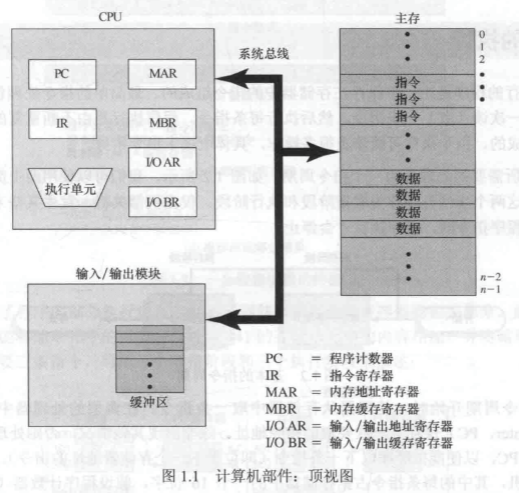
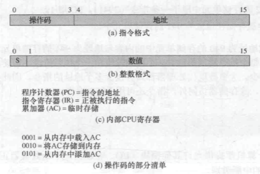
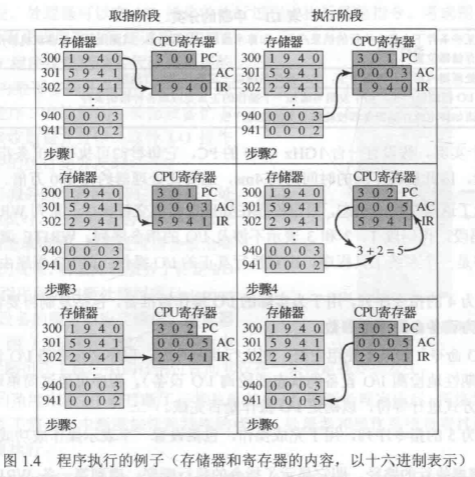
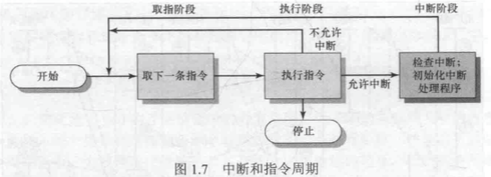

# 目录

### [第1章：计算机系统概述](#第一章计算机系统概述)

* [1.1基本构成](#1.1基本构成)
* [1.2微处理器的发展](#1.2微处理器的发展)
* [1.3指令的执行](#1.3指令的执行)
* [1.4中断](#1.4中断)
    * [1.4.1中断和指令周期](#1.4.1中断和指令周期)
    * [1.4.2中断处理](#1.4.2中断处理)
    * [1.4.3多个中断](#1.4.3多个中断)
* [1.5存储器的层次结构](#1.5存储器的层次结构)
* [1.6高速缓存](#1.6高速缓存)
    * [1.6.1动机](#1.6.1动机)
    * [1.6.2高速缓存原理](#1.6.2高速缓存原理)
    * [1.6.3高速缓存设计](#1.6.3高速缓存设计)
* [1.7直接内存存取](#1.7直接内存存取)
* [1.8多处理器和多核计算机组织结构](#1.8多处理器和多核计算机组织结构)
    * [1.8.1对称多处理器](#1.8.1对称多处理器)
    * [1.8.2多核计算机](#1.8.2多核计算机)
### [第2章：操作系统概述](#第二章：操作系统概述)
* [2.1操作系统的目标和功能](#2.1操作系统的目标和功能)
    * [2.1.1作为用户/计算机接口的操作系统](#2.1.1作为用户/计算机接口的操作系统)
    * [2.1.2作为资源管理器的操作系统](#2.1.2作为资源管理器的操作系统)
    * [2.1.3操作系统的易扩展性](#2.1.3操作系统的易扩展性)
* [2.2操作系统的发展史](#2.2操作系统的发展史)
    * [2.2.1串行处理](#2.2.1串行处理)
    * [2.2.2简单批处理系统](#2.2.2简单批处理系统)
    * [2.2.3多道批处理系统](#2.2.3多道批处理系统)
    * [2.2.4分时系统](#[2.2.4分时系统)
* [2.3主要成就](#2.3主要成就)
    * [2.3.1进程](#2.3.1进程)
    * [2.3.2内存管理](#2.3.2内存管理)
    * [2.3.3信息保护和安全](#2.3.3信息保护和安全)
    * [2.3.4调度和资源管理](#2.3.4调度和资源管理)
* [2.4现代操作系统的特征](#2.4现代操作系统的特征)
* [2.5容错性](#2.5容错性)
    * [2.5.1基本概念](#2.5.1基本概念)
    * [2.5.2错误](#2.5.2错误)
    * [2.5.3操作系统机制](#2.5.3操作系统机制)
* [2.6多处理器和多核操作系统](#2.6多处理器和多核操作系统)
    * [2.6.1对称多处理器操作系统设计考虑因素](#2.6.1对称多处理器操作系统设计考虑因素)
    * [2.6.2多核操作系统设计考虑因素](#2.6.2多核操作系统设计考虑因素)
* 第三章 进程描述和控制
* 第四章 线程
* 第五章 并发性：互斥和同步
* 第六章 并发：死锁和饥饿
* 第七章 内存管理
* 第八章 虚拟内存
* 第九章 单处理器调度
* 第十章 多处理器和实时调度
* 第十一章 I/O管理和磁盘调度
* 第十二章 文件管理
* 第十三章 嵌入式操作系统
* 第十四章 虚拟机
* 第十五章 计算机安全技术
* 第十六章 分布式处理、客户-服务器和集群

# [第一章：计算机系统概述](#第1章计算机系统概述)
## [1.1基本构成](#第1章计算机系统概述)
计算机由处理器、存储器和输入/输出部件组成，每类部件都有一个或多个模块。这些部件以某种方式互联，以实现计算机执行程序的主要功能。

计算机有4各个要的结构化部件：
- 处理器（Processor）：控制计算机的操作，执行数据处理功能。
- 内存（Main memory）：存储数据和程序。此类存储器通常是易失性的，即当计算机关机时，存储器的内容会丢失，相对的是存盘存储器。
- 输入/输出模块（I/O modules）：在计算机和外部环境之间移动数据。
- 系统总线（System bus）：在处理器、内存和输入/输出模块间提供通信的设施



处理器的一个功能是与存储器交换数据。它通常使用的内部寄存器有：
- 存储器地址寄存器（Memory Address Register，MAR），用于确定下一次读/写的存储器地址
- 存储器缓冲寄存器（Memory Buffer Register，MBR），存放要写入存储器的数据或从存储器中读取的数据
- I/O地址寄存器（I/O Address Register），用于确定一个特定的输入/输出设备
- I/O缓冲寄存器（I/O Buffer Register），用于在输入/输出模块和处理器间交换数据

内存模块由一组单元组成组成，这些单元由顺序编号的地址定义。每个单元包含一个二进制数，可解释为一个指令或数据

输入/输出模块在外部设备与处理器和存储器之间传输数据，包含内存缓冲区，用于临时保存数据。

## [1.2微处理器的发展](#第1章计算机系统概述)

略

## [1.3指令的执行](#第1章计算机系统概述)

处理器执行的程序是由一组保存在存储器中的指令组成的。

程序执行是由不断重复地取指令和执行指令的过程组成的。

单个指令所需要的处理称为一个<b>```指令周期```</b>，可以分为<b>```取指阶段```</b>和<b>```执行阶段```</b>。仅当机器关机、发生某些未知错误或遇到与停机相关的程序指令时，程序执行才会停止。

在典型的处理器中，程序计数器（Program Counter，PC）保存下一次要取得指令地址。一般情况下，处理器取指后总是递增PC。

取到得指令放在处理器的指令寄存器（Instruction Register，IR）。处理器解释指令并执行相应的动作，可分为4类：
- 处理器-存储器：数据在存储器和处理器间传送
- 处理器-I/O：数据在处理器和外部设备间传送
- 数据处理：执行与数据相关的算术操作或逻辑操作
- 控制：某些指令可以改变执行顺序

程序执行例子：



累加器AC为数据存储器

所有指令和数据的长度均为16位

指令中有4位是操作码



描述了程序的部分执行过程。两个存储单元相加需要三个指令周期，如果使用更复杂的指令集，则需要的指令周期更少。

## [1.4中断](#第1章计算机系统概述)

事实上，所有计算机都提供允许其他模块中断处理器正常处理过程的机制。

中断的分类：
- 程序中断：在某些条件下由指令执行的结果产生。如算数溢出、除数为0
- 时钟中断：由处理器内部的计时器产生，允许操作系统以一定的规律执行函数
- I/O中断：由I/O控制器产生，用于发信号通知一个操作的正常完成或各种错误条件
- 硬件失效中断：由诸如掉电或存储器奇偶校验错之类的故障产生

### [1.4.1中断和指令周期](#第1章计算机系统概述)

为适应中断产生的情况，在指令周期中要增加一个中断阶段，此时，处理器检查是否有中断发生。若没有中断，处理器在取指周期取下一条指令，若有中断，处理器挂起当前程序的执行，并执行一个中断处理程序（操作系统的一部分，它确定中断的性值并执行所需要的操作），中断处理程序完成后，处理器在中断点恢复对用户程序的执行



### [1.4.2中断处理](#第1章计算机系统概述)

当I/O设备完成一次I/O操作时，发生下列事件

1. 设备给处理器发出一个中断信号。
2. 处理器在响应中断前结束当前指令的执行。
3. 处理器对中断进行测试，确定存在未响应的中断，并给提交中断的设备发送确认信号，确认信号允许该设备取消它的中断信号。
4. 处理器需要准备把控制权交到中断程序。需要保存从中断点回复当前程序所需要的信息，最少信息包括程序状态字PSW和保存在程序计数器PC中的下一条指令地址。它们被压入系统控制栈。
5. 处理器把响应此中断的中断处理程序入口地址装入程序计数器。
6. 中断处理程序开始处理中断，包括检查与I/O操作相关的状态信息或其他引起中断的事件。
7. 中断处理结束后，被保存的寄存器值从栈中释放并恢复到寄存器中。
8. 最后的操作是从栈中恢复PSW和程序计数器的值，因此下一条要执行的指令来自前面被中断的程序。

PSW中包含了当前运行进程的状态信息，包括内存使用信息、条件码和其他诸如允许中断/禁止中断位、内核/用户模式位等状态信息

### [1.4.3多个中断](#第1章计算机系统概述)

处理多个中断有两种方法：

第一种方法是正在处理一个中断时，禁止再发生中断。

- 过程：当用户程序正在执行时有一个中断发生，则立刻禁止中断，此时如果再有中断发生，就会被挂起；当中断处理程序完成后，在恢复用户程序之前再允许中断，并且由处理器检查是否还在有中断发生。
- 缺点：未考虑相对优先级和时间限制的要求

第二种方法是定义中断优先级，允许高优先级中断打断低优先级中断的运行

## [1.5存储器的层次结构](#第1章计算机系统概述)

存储器所用到的技术有以下关系：
- 存取时间越快，每“位”价格越高
- 容量越大，每“位”价格越低
- 容量越大，存取速度越慢

设计者面临的困难：需求是大容量和低价格，但为了性能，又需要使用昂贵的，容量较小且存取速度快的存储器

解决这一难题的方法不是依赖单一的存储组件或技术，而是使用<b>```存储器层次结构```</b>。

层次越靠后：
1. 每“位”价格越低
2. 容量越大
3. 存储时间越长
4. <b>```处理器访问存储器的频率越低```</b>

第四条有效的基础是访问的<b>```局部性原理```</b>。程序执行期间，处理器的指令访存和数据访存呈“簇”状。

## [1.6高速缓存](#第1章计算机系统概述)
### [1.6.1动机](#第1章计算机系统概述)

在全部指令周期中，处理器可能需要多次访问存储器。处理器执行指令的速度受存储器周期的限制。

### [1.6.2高速缓存原理](#第1章计算机系统概述)
高速缓存的目的是使得访问速度接近现有的最快存储器，同时支持价格较低的大存储容量

当处理器试图读取存储器中的一个字节或字时，要进行一次检查以确定该字是否在告诉缓存中。如果在，该字节从告诉缓存传递给处理器；如果不在，则由固定数目的字块组成的一块内存数据读入高速缓存，然后该字节从高速缓存传递给处理器。根据访问局部性原理，当一块数据被取入高速缓存以满足一次存储器访问时，很可能紧接着的多次访问的数据是该块中的其他字节。

高速缓存/内存的系统结构。内存由2<sup>n</sup>个可寻址的字组成，每个字有唯一的n位地址。为便于映射，该存储器可视为由一些固定大小的块组成，每块包含K个字，共有M=2<sup>n</sup>/K个块。高速缓存中有C个存储槽，每个槽有K个字，槽的数量远小于存储器块的数目。由于块的数量比槽多，因此，每个槽中有一个标签，用以标识当前存储的是哪个块。标签通常是地址中较高的若干位，表示已这些位开始的所有地址。

### [1.6.3高速缓存设计](#第1章计算机系统概述)

在进行虚拟存储器和磁盘高速缓冲设计时，需要解决以下几类问题：
- 高速缓存大小
- 块大小
- 映射函数
- 置换算法
- 写策略
- 高速缓存的级数

高速缓存大小：适当小的高速缓存会对性能产生明显的影响。

块大小：当块大小从很小增长到很大时，由于局部性原理，命中率首先会增加，但当块变得更大时，新近取到的数据被用到的可能性开始小于那些必须移出高速缓存的数据再次被用到的可能性，这时命中率开始降低。

映射函数：新块读入高速缓存中时，将由映射函数确定这个块将占据哪个高速缓存单元。映射函数应该能够尽量减小置换出的块在不久的将来还会被用到的可能性。映射函数设计的越灵活，就越有余地来设计出增加命中率的置换算法，但是越灵活，完成搜索所需要的逻辑电路越复杂。

置换算法：新块加入高速缓存中时，如果高速缓存中的所有存储槽已被其他块占满，那么置换算法要选择未来被访问的可能性最小的块。

写策略：若高速缓存中某个块被修改，则需要在其换出高速缓存前，将其写回内存。写策略规定何时发生存储器写操作。

## [1.7直接内存存取](#第1章计算机系统概述)

执行I/O操作的技术有三种：可编程I/O、中断驱动I/O和直接内存存取（DMA）

可编程I/O（programmed I/O）：I/O模块执行请求的动作并设置状态寄存器中相应的位，但它不会通知处理器，也不会中断处理器。因此处理器在执行I/O指令后，还要定期检查I/O模块的状态，已确定I/O操作是否已经完成。它的问题是，处理器通常必须等待很长的时间以确定I/O模块是否做好了接收或发送更多数据的准备。处理器在等待期间必须不断地询问I/O模块的状态，因此会严重降低整个系统的性能。

中断驱动I/O（interrupt-driven I/O）：由处理器给I/O模块发送I/O命令，然后处理器做其他事情。当I/O模块准备好与处理器交换数据时，它将中断处理器并请求服务。

上述两种方法的缺陷：
1. I/O传送速度受限于处理器测试设备和提供服务的速度。
2. 处理器忙于管理I/O传送的工作，必须执行很多指令以完成I/O传送。

直接内存存取（Direct Memory Access，DMA）：DMA功能可以由系统总线中的一个独立模块完成，也可以并入一个I/O模块中。工作方式为：在处理器读或写一块数据时，给DMA模块产生一条命令，发送以下信息：
- 是否请求一条读或写
- 所涉I/O设备的地址
- 开始读或写的存储单元
- 需要读或写的字数

之后处理器继续工作。处理器把这个操作委托给DMA模块负责处理。DMA模块直接与存储器交互，传送整个数据块，每次传送一个字。传送完成后，DMA模块向处理器发送中断信号。处理器只有开始和结束时才会参与。

DMA模块需要控制总线来与存储器进行数据传送，因此会和处理器竞争总线，但性能相较前两种是提高了的。

## [1.8多处理器和多核计算机组织结构](#第1章计算机系统概述)
### [1.8.1对称多处理器](#第1章计算机系统概述)

对称多处理器（SMP）的定义：
1. 具有两个或两个以上可比性能的处理器
2. 这些处理器共享内存和I/O设备，通过总线互连。因此每个处理器的存放时间大体相同
3. 所有处理器可以执行相同的功能（因此是对称的）
4. 整个系统由一个统一的操作系统控制

优势：
- 性能：与单处理器系统相比性能更好
- 可用性：单个处理器失效不会导致停机，只是性能下降
- 渐进式成长：用户可以增加通过增加处理器以提高性能

### [1.8.2多核计算机](#第1章计算机系统概述)

略

# [第二章：操作系统概述](#第2章：操作系统概述)
## [2.1操作系统的目标和功能](#第2章：操作系统概述)

操作系统是控制应用程序执行的程序，是应用程序和计算机硬件间的接口。它有三个目标：
- 方便：使计算机更易于使用
- 有效：以更有效的方式使用计算机系统资源
- 扩展能力：在不妨碍服务的前提下，有效地开发、测试和引入新的系统功能

### [2.1.1作为用户/计算机接口的操作系统](#第2章：操作系统概述)

操作系统提供以下几个方面的服务：
- 程序开发：操作系统提供各式程序开发的工具和服务，如编辑器和调试器。这些服务以程序的形式出现。严格来说部署于操作系统核心部分。
- 程序运行：运行一个程序需要：把指令和数据加载到内存、初始化I/O设备和文件、准备其他资源。操作系统为用户处理这些问题。
- I/O设备访问：每个I/O设备的操作都需要自身特有的指令集和控制信号，操作系统隐藏这些细节，并提供统一的接口
- 文件访问控制：操作系统需要详细了解I/O设备特性、存储介质中文件数据的结构以及多用户文件访问的保护机制
- 系统访问：操作系统控制着对共享或公共系统的访问。访问模块需提供对资源和数据的保护以及解决资源竞争冲突问题
- 错误检测和响应：对于硬件错误和软件错误，操作系统必须提供响应以接触错误条件。响应可以是终止引起错误的程序、重试操作或简单地给应用程序报告错误
- 记账：操作系统收集对各种资源的利用率的统计数据，监控如响应时间等的性能参数

操作系统中的三种重要接口：
- 指令系统体系结构（ISA）：定义了计算机遵循的机器语言指令系统，该接口是硬件与软件的分界线。应用程序和实用程序可以访问指令系统的子集（用户级ISA），操作系统可以访问其他机器语言指令（系统级ISA）
- 应用程序二进制接口（ABI）：这个接口定义了程序间二进制可移植性的标准。ABI定义了操作系统的系统调用接口，以及在系统中通过ISA能使用的硬件资源和服务
- 应用程序编程接口（API）：API允许应用程序访问系统的硬件资源和服务，这些服务由用户级ISA和高级语言库HLL调用来提供。

补充：[ABI与API](ABI与API.md)

### [2.1.2作为资源管理器的操作系统](#第2章：操作系统概述)


### [2.1.3操作系统的易扩展性](#第2章：操作系统概述)


## [2.2操作系统的发展史](#第2章：操作系统概述)


### [2.2.1串行处理](#第2章：操作系统概述)


### [2.2.2简单批处理系统](#第2章：操作系统概述)


### [2.2.3多道批处理系统](#第2章：操作系统概述)


### [2.2.4分时系统](#第2章：操作系统概述)


## [2.3主要成就](第2章：操作系统概述#)


### [2.3.1进程](#第2章：操作系统概述)


### [2.3.2内存管理](#第2章：操作系统概述)


### [2.3.3信息保护和安全](#第2章：操作系统概述)


### [2.3.4调度和资源管理](#第2章：操作系统概述)


## [2.4现代操作系统的特征](#第2章：操作系统概述)


## [2.5容错性](#第2章：操作系统概述)


### [2.5.1基本概念](#第2章：操作系统概述)


### [2.5.2错误](#第2章：操作系统概述)


### [2.5.3操作系统机制](#第2章：操作系统概述)


## [2.6多处理器和多核操作系统](#第2章：操作系统概述)


### [2.6.1对称多处理器操作系统设计考虑因素](#第2章：操作系统概述)


### [2.6.2多核操作系统设计考虑因素](#第2章：操作系统概述)


